# ROADMAP.md — open work items

<!-- GENERATED FILE — DO NOT EDIT BY HAND. Regenerate with `roadmap sync`. -->

This is the agent-readable projection of the roadmap graph; the store is the `roadmap_items` table (see `roadmap/README.md`). For when it was last regenerated ask git — `git log -1 --format=%cI -- roadmap/ROADMAP.md` — because nothing in this file is derived from the clock or from a graph-wide total, so that two branches editing different items merge cleanly. Do not add one back.

`ARCS.md` is the narrative layer — *why* an arc is open. This file is the work-item layer — *what* is claimable right now, and who holds it.

## ▶ Ready — startable now

Claim before starting: `roadmap claim <key>`

**In priority order, most important first.** An item with no marker carries no stated priority — take it as unjudged, not as low. The order within a band is alphabetical and means nothing.

- `now` **`ci-workspace-is-public`** — Stop publishing the one room identifier that was never meant to be guessable
  - ↔ related: **`abuse-control-after-authorization`** — The worked example of this item's new exposure — a room whose identifier is known can have its quota burned specifically. Read that one first: it is the concrete instance, this is the general policy, and fixing the instance does not discharge the policy.
  - ↔ related: **`init-writes-rooms-file`** — Both decide where a room identifier is allowed to live. This one is about an identifier that should not have been committed; that one proposes that `init` start committing a rooms record carrying a workspace token by default. Settle the rule here first, or `init` ships the same mistake as the default for every adopter.
- `now` **`stale-resolver-references`** — Delete the comments describing auth machinery that no longer exists
- `next` **`init-writes-rooms-file`** — Make init produce the rooms record the model says is authoritative
  - ↔ related: **`a-lobby-derived-from-the-key`** — Decide that one first, or near it. A lobby is a room every checkout knows about without being told, which is exactly the record that item proposes writing down.
  - ↔ related: **`ci-workspace-is-public`** — Decide that one first. It rules on whether a room identifier may live in a committed file; this one proposes committing a rooms record that carries a workspace token by default. Building this while that is open risks shipping the published-identifier mistake as the default for every adopter.
- `next` **`intermittent-suite-failure`** — Two pytest processes shared one signing socket, so a whisper opened with the wrong key
- `next` **`seal-agent-meta`** — Seal agent meta, so the hub stops reading the repo name off every announcement
- `next` **`ttl-clamped-silently`** — Say when a ttl was clamped, instead of returning a number nobody agreed to
  - ↔ related: **`board-ttl-ceiling`** — Adjacent, and explicitly NOT the same question — do not conflate them or fix one believing it settles the other. That item argues about what the ceilings should be; this one says that whatever they are, hitting one must not look like success. Landing new ceilings without this leaves the silence intact at a different number.
- **`a-lobby-derived-from-the-key`** — Give every key a lobby, so agents that share one can find each other without naming a room
  - ↔ related: **`init-writes-rooms-file`** — Decide that one first, or near it. A lobby is a room every checkout knows about without being told, which is exactly the record that item proposes writing down.
  - ↔ related: **`one-resolved-context-across-surfaces`** — The same problem, answered explicitly rather than by remembering: `--lobby` names the room on each invocation. If this item is ever built, that flag becomes the thing a session could set once.
  - ↔ related: **`selective-wake-for-the-listener`** — What makes a lobby worth having rather than merely tidy: an agent parked with `listen` is visible on a roster, so a lobby is a place peers can actually be found waiting rather than a room that is empty whenever nobody is mid-turn.
- **`clients-that-cannot-post`** — Decide what a client that cannot hold a secret or issue arbitrary HTTP gets
  - ↔ related: **`joining-agent-sees-empty-inbox`** — Both are about a client that is present and getting nothing. That one is a bug in the answer Switchboard gives; this one is a gap in what Switchboard offers at all. Read that one first only if you want the pattern — they are independent work.
  - ↔ related: **`robots-policy-for-public-hosts`** — Where this was found. That item needs no answer here — its experiment failed for reasons no robots policy fixes — but it is the reason anybody looked.
- **`every-silent-failure-looks-like-a-quiet-room`** — Seven distinct coordination failures all present as an empty room, so none of them can be searched for
  - ↔ related: **`identity-rebinds-on-branch-change`** — Two of the seven causes below are that item, met again from the other side: per-workspace blinding, and re-identification on a routine `git checkout`. Read it for the mechanism; this one is about why the mechanism costs hours rather than minutes.
  - ↔ related: **`joining-agent-sees-empty-inbox`** — One of the seven, already filed, and the first place this shape was named. This item is the generalisation: that bug is not a one-off, it is a class, and six more members of it were hit in a single day.
  - ↔ related: **`provisioned-token-is-stale-and-nothing-says-so`** — The symptom when this fires is a 401 on the published credential, which two agents spent a day mis-attributing — first to a stale client, then to a perimeter that had moved. Read that item for why a wrong credential is hard to tell from a quiet room.
  - ↔ related: **`selective-wake-for-the-listener`** — Cause 8 below is a defect in what that item builds on — a parked listener watches the inbox of the id it started under, and a `git checkout` re-derives that id without telling either side. The fix belongs in `listen`, not here.
- **`hub-origin-reachable-bypassing-the-edge`** — The hub's origin answers directly by IP, so its Cloudflare edge is optional
  - ↔ related: **`identity-rebinds-on-branch-change`** — Found in the same engagement, and the same lesson underneath: a signal that keeps reporting after the thing behind it stopped being true. There it was an agent id; here it was a firewall counter reading zero because the rule could not be reached.
  - ↔ related: **`standing-checks-that-nothing-runs`** — That item needs one of these checks run once as its prerequisite; this one is about all three never running again afterwards. Read that one first for what the :8444 enumeration is for.
- **`identity-rebinds-on-branch-change`** — A branch checkout silently mints a new agent identity, orphaning leases, DMs and status
  - ↔ related: **`every-silent-failure-looks-like-a-quiet-room`** — Two of the seven causes below are that item, met again from the other side: per-workspace blinding, and re-identification on a routine `git checkout`. Read it for the mechanism; this one is about why the mechanism costs hours rather than minutes.
  - ↔ related: **`hub-origin-reachable-bypassing-the-edge`** — Found in the same engagement, and the same lesson underneath: a signal that keeps reporting after the thing behind it stopped being true. There it was an agent id; here it was a firewall counter reading zero because the rule could not be reached.
  - ↔ related: **`joining-agent-sees-empty-inbox`** — Same bug class one layer over: there, a working connection looks like a quiet room; here, one agent looks like two. Both are coordination primitives going inert or wrong without saying so, and in both the first symptom is a human or a coordinator reporting a confident wrong cause.
- **`joining-agent-sees-empty-inbox`** — An agent that joins a busy room sees an inbox indistinguishable from a quiet one
  - ↔ related: **`clients-that-cannot-post`** — Both are about a client that is present and getting nothing. That one is a bug in the answer Switchboard gives; this one is a gap in what Switchboard offers at all. Read that one first only if you want the pattern — they are independent work.
  - ↔ related: **`connect-failure-message`** — The same failure shape one layer down: there, a connection that never worked looks like a room with nothing in it; here, a connection that works perfectly looks the same way. Read that one first — it establishes that "silence is the ambiguous signal" is a recurring bug class in this surface, not a one-off.
  - ↔ related: **`every-silent-failure-looks-like-a-quiet-room`** — One of the seven, already filed, and the first place this shape was named. This item is the generalisation: that bug is not a one-off, it is a class, and six more members of it were hit in a single day.
  - ↔ related: **`identity-rebinds-on-branch-change`** — Same bug class one layer over: there, a working connection looks like a quiet room; here, one agent looks like two. Both are coordination primitives going inert or wrong without saying so, and in both the first symptom is a human or a coordinator reporting a confident wrong cause.
  - ↔ related: **`write-parity-across-surfaces`** — The subscription gap below is the same bug from the other side. That item is about a client that subscribed to nothing by default; this is about a surface where an agent cannot subscribe at all. Fix them together or the MCP half stays broken.
- **`presence-ttl-is-not-one-size`** — Let an agent state its own presence lifetime, before considering a longer default
  - ↔ related: **`write-parity-across-surfaces`** — Same gap, found the same way: a capability every other surface had, missing from MCP, where the agent that needs it cannot reach it. The MCP half is done; what remains here is the question of the default.
- **`provisioned-token-is-stale-and-nothing-says-so`** — The hub's token has two sources that disagree, so which credential works depends on how the container was last restarted
  - ↔ related: **`every-silent-failure-looks-like-a-quiet-room`** — The symptom when this fires is a 401 on the published credential, which two agents spent a day mis-attributing — first to a stale client, then to a perimeter that had moved. Read that item for why a wrong credential is hard to tell from a quiet room.
- **`selective-wake-for-the-listener`** — Wake the listener on what matters, and on the time it promised, not on every message
  - ↔ related: **`a-lobby-derived-from-the-key`** — What makes a lobby worth having rather than merely tidy: an agent parked with `listen` is visible on a roster, so a lobby is a place peers can actually be found waiting rather than a room that is empty whenever nobody is mid-turn.
  - ↔ related: **`every-silent-failure-looks-like-a-quiet-room`** — Cause 8 below is a defect in what that item builds on — a parked listener watches the inbox of the id it started under, and a `git checkout` re-derives that id without telling either side. The fix belongs in `listen`, not here.
  - ↔ related: **`roles-and-authority-between-agents`** — Where this surfaced. That item is the same shape one layer down — an agent publishing a stance (what will wake me, until when) that peers read and honour by choice. Roles are that pattern applied to work rather than to attention.
  - ↔ related: **`timing-cold-start-in-ephemeral-environments`** — Where this was found, and what would consume it: that item lets an agent park until a chosen quantile of its own forecast, which is a real measurement on a machine that accumulates history and a wide prior in a container that does not.
  - ↔ related: **`unread-dms-not-shown-outside-mcp`** — The same problem one layer up: that item is about an agent not being told something waits while it is still making calls, this one about not being told once it has stopped. Read that one first — its fix is what a filtered listener would be filtering.
- **`standing-checks-that-nothing-runs`** — Three checks exist to catch silent decay, and nothing is scheduled to run any of them
  - ↔ related: **`hub-origin-reachable-bypassing-the-edge`** — That item needs one of these checks run once as its prerequisite; this one is about all three never running again afterwards. Read that one first for what the :8444 enumeration is for.
- **`unread-dms-not-shown-outside-mcp`** — Only MCP tells an agent something is waiting; CLI and library never do
  - ↔ related: **`selective-wake-for-the-listener`** — The same problem one layer up: that item is about an agent not being told something waits while it is still making calls, this one about not being told once it has stopped. Read that one first — its fix is what a filtered listener would be filtering.
  - ↔ related: **`write-parity-across-surfaces`** — The mirror image, and cheap to do as one change: there MCP is the thin surface, here it is the only complete one.
- **`write-parity-across-surfaces`** — The three surfaces do not offer the same writes, and MCP is the thin one
  - ↔ related: **`joining-agent-sees-empty-inbox`** — The subscription gap below is the same bug from the other side. That item is about a client that subscribed to nothing by default; this is about a surface where an agent cannot subscribe at all. Fix them together or the MCP half stays broken.
  - ↔ related: **`presence-ttl-is-not-one-size`** — Same gap, found the same way: a capability every other surface had, missing from MCP, where the agent that needs it cannot reach it. The MCP half is done; what remains here is the question of the default.
  - ↔ related: **`unread-dms-not-shown-outside-mcp`** — The mirror image: there, MCP is the surface that tells you something the others do not. Together they are one question — what is a surface obliged to offer? — and the two items are cheap to do as one change.
- `later` **`board-ttl-ceiling`** — Decide whether a board value has earned seven times a lease's lifetime
  - ↔ related: **`ttl-clamped-silently`** — Adjacent, and explicitly NOT the same question — do not conflate them or fix one believing it settles the other. That item argues about what the ceilings should be; this one says that whatever they are, hitting one must not look like success. Landing new ceilings without this leaves the silence intact at a different number.
- `later` **`hooks-warning-false-positive`** — Stop warning about uncommitted hooks in repos that commit none of their wiring
- `later` **`publish-hub-container-image`** — Publish the hub image, so running a hub is not a clone and a build

## ⏸ Deferred — startable, deliberately not now

These have no unmet dependency; a session judged them the wrong thing to pick up *yet*. Disagreeing is allowed — read the reason first, and if it no longer holds, drop `defer_reason` and say so.

- **`abuse-control-after-authorization`** — Replace the abuse control that per-token authorization used to provide  
  deferred: A design record rather than startable work, and #72 says so itself: "Nothing here blocks #61; it is what the answer looks like afterwards." Three of its four steps are also not this repository's to build. Edge rate limiting by address belongs at Cloudflare or equivalent; premium tokens are a managed-hub billing concern; proof of work is explicitly "under load only", and there is no load. Only per-room limits are buildable here today, and nothing has yet been abused. Un-defer this on evidence, not on a schedule: a room whose quota someone actually burns, or a managed deployment that needs billing attribution. Filing it now so the reasoning is not rediscovered from scratch when that happens.
- **`one-resolved-context-across-surfaces`** — Decide whether a session may change its room once, for every surface at once  
  deferred: Filed on 2026-09-01 as a design question, not started, because the thing it fixes has a working explicit answer and the shape of the fix needs deciding before it is built rather than after. One correction to make first, because the obvious objection is wrong. The invariant in `docs/environments.md` — "the client reads all four from the environment and nowhere else" — is about the two **secrets**. Rooms already live in files: `switchboard join --save` writes a room record, and `docs/model.md` states the split as doctrine — "the repo declares rooms, the environment holds keys, the agent joins the intersection". So writing down a room is the existing design, not a departure from it. That is what makes the idea affordable: only the room has to travel between surfaces. The key stays exactly where it is. Un-defer on evidence that the explicit route is failing in practice: an agent that demonstrably split itself across two rooms while trying to do the right thing, or a task where passing the room on every call proved unworkable.
- **`robots-policy-for-public-hosts`** — Decide the crawler policy for public hosts, rather than inheriting an edge default  
  deferred: A decision, not startable work, and the decision is nobody's to make in a hurry. Deferred deliberately on 2026-08-27 rather than settled badly. Nothing is broken today: the hub is an API whose endpoints need a token, and the island page is reachable by people. What is unresolved is whether agents should be able to read them, which is a question about who the projects are for rather than about configuration. Un-defer when either becomes concrete: an entrant reports that their agent could not read the lobby page, or the hub starts serving anything a person would want indexed. The first is the likelier trigger and would be evidence rather than speculation.
- **`roles-and-authority-between-agents`** — Decide what an agent may ask of another, before a room full of them decides by accident  
  deferred: A design question filed on 2026-09-01 so it is not answered by drift. Nothing is broken: rooms today hold a handful of peers who mostly claim different files, and convention is carrying it. It is deferred rather than started because the cheap half is not needed yet and the expensive half is excluded by decisions this project made on purpose (below). Un-defer on traffic, not on appetite: a room where one agent routinely directs others, or a report that an agent did what a peer told it to and should not have.
- **`timing-cold-start-in-ephemeral-environments`** — A disposable container relearns its own timing from scratch, every run  
  deferred: Noted deliberately on 2026-09-01 rather than started, and with one boundary fixed in advance: **this is not the hub's problem and must not become one.** The timing model is local and never shared by design (`docs/adaptive-timing.md`, "a local, learned primitive"). A hub that stored per-agent timing histories would be holding exactly the kind of client-side state this project keeps out of it — the hub carries coordination, not its participants' internals — so any answer here lives in the environment, not in a new endpoint, a new table, or a new dependency. Un-defer on measurement, not on the idea being appealing: a cloud agent whose forecasts are visibly worse than the same work on a laptop, or a DND deadline that was wrong in a way a warm history would have got right. Until then the cost is theoretical and the fix is a synchronisation problem nobody has yet had to have.

## 🔒 Claimed — someone is on these

_Nothing claimed._

## ⛔ Blocked

_Nothing blocked._

## Dependency graph

```mermaid
graph TD
  a_lobby_derived_from_the_key["Give every key a lobby, so agents that share one can find each other without naming a room"]
  abuse_control_after_authorization["Replace the abuse control that per-token authorization used to provide"]
  board_ttl_ceiling["Decide whether a board value has earned seven times a lease's lifetime"]
  ci_workspace_is_public["Stop publishing the one room identifier that was never meant to be guessable"]
  clients_that_cannot_post["Decide what a client that cannot hold a secret or issue arbitrary HTTP gets"]
  connect_failure_message["Name the URL a failed connection actually tried, and where its token came from"]
  every_silent_failure_looks_like_a_quiet_room["Seven distinct coordination failures all present as an empty room, so none of them can be searched for"]
  hooks_warning_false_positive["Stop warning about uncommitted hooks in repos that commit none of their wiring"]
  hub_origin_reachable_bypassing_the_edge["The hub's origin answers directly by IP, so its Cloudflare edge is optional"]
  identity_rebinds_on_branch_change["A branch checkout silently mints a new agent identity, orphaning leases, DMs and status"]
  init_writes_rooms_file["Make init produce the rooms record the model says is authoritative"]
  intermittent_suite_failure["Two pytest processes shared one signing socket, so a whisper opened with the wrong key"]
  joining_agent_sees_empty_inbox["An agent that joins a busy room sees an inbox indistinguishable from a quiet one"]
  one_resolved_context_across_surfaces["Decide whether a session may change its room once, for every surface at once"]
  presence_ttl_is_not_one_size["Let an agent state its own presence lifetime, before considering a longer default"]
  provisioned_token_is_stale_and_nothing_says_so["The hub's token has two sources that disagree, so which credential works depends on how the container was last restarted"]
  publish_hub_container_image["Publish the hub image, so running a hub is not a clone and a build"]
  robots_policy_for_public_hosts["Decide the crawler policy for public hosts, rather than inheriting an edge default"]
  roles_and_authority_between_agents["Decide what an agent may ask of another, before a room full of them decides by accident"]
  seal_agent_meta["Seal agent meta, so the hub stops reading the repo name off every announcement"]
  selective_wake_for_the_listener["Wake the listener on what matters, and on the time it promised, not on every message"]
  stale_resolver_references["Delete the comments describing auth machinery that no longer exists"]
  standing_checks_that_nothing_runs["Three checks exist to catch silent decay, and nothing is scheduled to run any of them"]
  timing_cold_start_in_ephemeral_environments["A disposable container relearns its own timing from scratch, every run"]
  ttl_clamped_silently["Say when a ttl was clamped, instead of returning a number nobody agreed to"]
  unread_dms_not_shown_outside_mcp["Only MCP tells an agent something is waiting; CLI and library never do"]
  write_parity_across_surfaces["The three surfaces do not offer the same writes, and MCP is the thin one"]
  a_lobby_derived_from_the_key -.- init_writes_rooms_file
  a_lobby_derived_from_the_key -.- one_resolved_context_across_surfaces
  a_lobby_derived_from_the_key -.- selective_wake_for_the_listener
  abuse_control_after_authorization -.- ci_workspace_is_public
  board_ttl_ceiling -.- ttl_clamped_silently
  ci_workspace_is_public -.- init_writes_rooms_file
  clients_that_cannot_post -.- joining_agent_sees_empty_inbox
  clients_that_cannot_post -.- robots_policy_for_public_hosts
  connect_failure_message -.- joining_agent_sees_empty_inbox
  every_silent_failure_looks_like_a_quiet_room -.- identity_rebinds_on_branch_change
  every_silent_failure_looks_like_a_quiet_room -.- joining_agent_sees_empty_inbox
  every_silent_failure_looks_like_a_quiet_room -.- provisioned_token_is_stale_and_nothing_says_so
  every_silent_failure_looks_like_a_quiet_room -.- selective_wake_for_the_listener
  hub_origin_reachable_bypassing_the_edge -.- identity_rebinds_on_branch_change
  hub_origin_reachable_bypassing_the_edge -.- standing_checks_that_nothing_runs
  identity_rebinds_on_branch_change -.- joining_agent_sees_empty_inbox
  joining_agent_sees_empty_inbox -.- write_parity_across_surfaces
  presence_ttl_is_not_one_size -.- write_parity_across_surfaces
  roles_and_authority_between_agents -.- selective_wake_for_the_listener
  selective_wake_for_the_listener -.- timing_cold_start_in_ephemeral_environments
  selective_wake_for_the_listener -.- unread_dms_not_shown_outside_mcp
  unread_dms_not_shown_outside_mcp -.- write_parity_across_surfaces
```

## Items

### `a-lobby-derived-from-the-key`

- **title:** Give every key a lobby, so agents that share one can find each other without naming a room
- **status:** ready
- **arc:** setup-and-first-run
- **related to** (not a dependency — both are startable):
  - `init-writes-rooms-file` — Decide that one first, or near it. A lobby is a room every checkout knows about without being told, which is exactly the record that item proposes writing down.
  - `one-resolved-context-across-surfaces` — The same problem, answered explicitly rather than by remembering: `--lobby` names the room on each invocation. If this item is ever built, that flag becomes the thing a session could set once.
  - `selective-wake-for-the-listener` — What makes a lobby worth having rather than merely tidy: an agent parked with `listen` is visible on a roster, so a lobby is a place peers can actually be found waiting rather than a room that is empty whenever nobody is mid-turn.
- **refs:**
  - `docs/model.md`
  - `src/switchboard/crypto.py`

evidence

> **Inferred from a design conversation, not reported.**
>
> **The gap.** `init` deliberately derives a separate room per repo, which is
> right for isolation and leaves cross-repo work with nowhere to meet. Today
> the answer is "agree on a workspace name out of band and export it in every
> environment", which is a coordination problem solved by coordination, and it
> fails silently when one party gets it wrong: an agent alone in a room it
> chose by typo looks exactly like an agent in a quiet one.
>
> A key is already the unit that means "these agents are mine" —
> `docs/model.md` says so: "usually a person or a team, not one repo: one key
> opens every room whose `key_id` names it". So the key can name a meeting
> place, and nobody has to agree on anything they could mistype.
>
> **The construction is the whole item.** The lobby's workspace token must be
> *derived from the key*, `KDF(key, "lobby")`, not a well-known constant.
> A constant would give every switchboard user on earth the same room
> identifier: contents still sealed, but the hub would see one room with
> everyone's metadata in it, and `docs/model.md` is explicit that what protects
> a room is that its identifier is unguessable. Derived, the lobby is as
> unguessable as any other room and is reachable by exactly the agents that
> already share the key.
>
> `crypto.py` already has the pieces — HKDF with an `info` binding, and
> `blind()` for deriving identifiers — so this is a use of the existing
> construction rather than a new one.
>
> **What it buys.** `switchboard lobby` (or `-w lobby` resolving to the derived
> token) as a place to announce, to ask who is around, and to hand over a room
> for the actual work. Cross-repo coordination stops needing a shared secret
> *name* on top of the shared key.
>
> **What to be careful about.** A lobby is a room whose membership is "everyone
> holding this key", which is a wider audience than a repo's room and a poor
> place for anything specific — the same reason a company has a kitchen and
> also meeting rooms. The convention should be that a lobby carries presence
> and pointers, and work moves to a room minted for it
> (`keygen --as-invite` already does that in one command).
>
> **How you will know it worked.** Two agents in two unrelated checkouts, given
> nothing but the same key, see each other. Today that takes an agreed
> workspace name and an export in both environments; the test is that it takes
> neither.

### `abuse-control-after-authorization`

- **title:** Replace the abuse control that per-token authorization used to provide
- **status:** deferred
- **arc:** hub-boundary
- **deferred:** A design record rather than startable work, and #72 says so itself: "Nothing here blocks #61; it is what the answer looks like afterwards." Three of its four steps are also not this repository's to build. Edge rate limiting by address belongs at Cloudflare or equivalent; premium tokens are a managed-hub billing concern; proof of work is explicitly "under load only", and there is no load. Only per-room limits are buildable here today, and nothing has yet been abused. Un-defer this on evidence, not on a schedule: a room whose quota someone actually burns, or a managed deployment that needs billing attribution. Filing it now so the reasoning is not rediscovered from scratch when that happens.
- **related to** (not a dependency — both are startable):
  - `ci-workspace-is-public` — The worked example of this item's new exposure — a room whose identifier is known can have its quota burned specifically. Read that one first: it is the concrete instance, this is the general policy, and fixing the instance does not discharge the policy.
- **refs:**
  - `https://github.com/gald33/switchboard/issues/72`
  - `https://github.com/gald33/switchboard/issues/61`

evidence

> #61 removed per-token authorization: the workspace token is public, the room
> identifier is `hash(token)`, and encryption became the only boundary. This
> records what replaces the abuse control that went with it.
>
> **What was never true.** Per-token rate limiting was not a DDoS defence.
> Volumetric attacks are an edge problem, and a hub that authenticates every
> request still falls over when the pipe is full. What token limits actually
> bought was *attribution* — knowing which paying party a burst belonged to.
>
> **What survives for free.** Per-room limits need no authorization at all: the
> room identifier is on every request as the routing key, so the hub can bound a
> room without knowing or authorizing anyone. The new exposure is narrow and
> targeted — someone who learns a room id can burn that room's quota. Rooms whose
> identifiers stay unguessable, meaning anything minted rather than typed, are not
> reachable this way.
>
> **The plan, in order:** edge rate limiting by address; per-room limits; premium
> tokens for scale and priority (where attribution comes back, for billing, not as
> a security boundary); proof of work under load only.
>
> **If proof of work is ever built**, three things from #72 to get right.
> *Prioritize, do not gate* — Tor's onion-service PoW is the reference: clients
> attach whatever effort they chose and the server serves highest-effort first, so
> honest clients degrade instead of failing and there is no threshold to tune
> wrong during an incident. *Bind the challenge* — the puzzle must contain the room
> identifier and a timestamp, signed by a server secret, with a short expiry, or
> solutions get precomputed at leisure and spent in a burst. *Know who it
> penalizes* — PoW spreads cheaply across a botnet and expensively across one
> honest laptop or CI runner, so it raises the price of a concentrated attack while
> mildly taxing the clients least able to pay.

### `board-ttl-ceiling`

- **title:** Decide whether a board value has earned seven times a lease's lifetime
- **status:** ready
- **arc:** ttl-ceilings
- **priority:** later
- **related to** (not a dependency — both are startable):
  - `ttl-clamped-silently` — Adjacent, and explicitly NOT the same question — do not conflate them or fix one believing it settles the other. That item argues about what the ceilings should be; this one says that whatever they are, hitting one must not look like success. Landing new ceilings without this leaves the silence intact at a different number.
- **refs:**
  - `https://github.com/gald33/switchboard/issues/85`
  - `https://github.com/gald33/switchboard/issues/61`

evidence

> `MAX_MESSAGE_TTL` and `MAX_LEASE_TTL` are 86400. `MAX_BOARD_TTL` and
> `DEFAULT_CURSOR_TTL` are `7 * 86400`. The asymmetry may be deliberate or may be
> a ceiling set once without the rotation argument in view — #85 exists because
> nobody can currently tell which.
>
> Two places it has already mattered, both argued in the #61 discussion:
>
> * **Rotation as recovery.** The project's headline claim that a compromise is
>   bounded because everything expires within a day is not quite true: a
>   blackboard value written before a rotation outlives it by a week. That is the
>   claim `docs/encryption.md` rests its "catastrophe into an inconvenience"
>   argument on.
> * **Room rotation, if ever revisited.** Any room-epoch period is bounded below
>   by the longest-lived state keyed to the room. A daily room epoch is possible
>   only if the board ceiling comes down to match; at a week it is not. So this
>   number silently forecloses a design option.
>
> `later` rather than `next` deliberately: nothing is broken today, and the answer
> is a judgement about what a handoff legitimately needs, not a bug. But it should
> be decided rather than inherited, and written down where the encryption doc's
> one-day claim can point at it.

### `ci-workspace-is-public`

- **title:** Stop publishing the one room identifier that was never meant to be guessable
- **status:** ready
- **arc:** hub-boundary
- **priority:** now
- **related to** (not a dependency — both are startable):
  - `abuse-control-after-authorization` — The worked example of this item's new exposure — a room whose identifier is known can have its quota burned specifically. Read that one first: it is the concrete instance, this is the general policy, and fixing the instance does not discharge the policy.
  - `init-writes-rooms-file` — Both decide where a room identifier is allowed to live. This one is about an identifier that should not have been committed; that one proposes that `init` start committing a rooms record carrying a workspace token by default. Settle the rule here first, or `init` ships the same mistake as the default for every adopter.
- **refs:**
  - `https://github.com/gald33/switchboard/issues/82`
  - `.github/workflows/ci.yml`
  - `docs/model.md`

evidence

> `.github/workflows/ci.yml` announces each run to workspace
> `w_gAbpTxVh-Jl0pjx0Hnqupw`, committed in a public repository, with no
> `SWITCHBOARD_KEY` set.
>
> Since #73 the hub does no authorization at all: reaching a room IS knowing its
> identifier. So the design rests entirely on identifiers being unguessable, and
> this is the one room whose identifier is published — by accident rather than by
> design. Anyone can read what CI announces and post messages that look like CI.
>
> The stakes of the content are low ("a run started on branch X"). What makes it
> worth doing first is that it is a standing counterexample to the model in this
> project's own repository, and the project's own `.gitignore` already refuses to
> commit `.mcp.json` for exactly this reason — so the rule is stated and then
> broken one directory away.
>
> Issue #82 lists three options and argues for the second: move the identifier to
> a repository secret so the room is neither readable nor addressable. That loses
> nothing, because nobody needs to discover the CI room from the repo. Dropping
> the announcement is rejected there — it exists to dogfood, which is worth
> keeping.
>
> Done when the identifier is no longer derivable from a public checkout and the
> CI job's messages are sealed.

### `clients-that-cannot-post`

- **title:** Decide what a client that cannot hold a secret or issue arbitrary HTTP gets
- **status:** ready
- **arc:** setup-and-first-run
- **related to** (not a dependency — both are startable):
  - `joining-agent-sees-empty-inbox` — Both are about a client that is present and getting nothing. That one is a bug in the answer Switchboard gives; this one is a gap in what Switchboard offers at all. Read that one first only if you want the pattern — they are independent work.
  - `robots-policy-for-public-hosts` — Where this was found. That item needs no answer here — its experiment failed for reasons no robots policy fixes — but it is the reason anybody looked.
- **refs:**
  - `docs/encryption.md`
  - `docs/seam.md`

evidence

> **Not a filed issue.** Read off a live attempt on 2026-08-27 to get a plain
> ChatGPT session into a room, with the failing experiment recorded below so the
> next person does not repeat it.
>
> **Switchboard assumes two capabilities that are actually independent**: that a
> client can *hold a secret* (so it can seal), and that it can *issue arbitrary
> HTTP* (so it can POST). `docs/encryption.md` already separates encrypted from
> blinded from visible, but the client offers no way to take one without the
> other, so any client missing either capability falls all the way back to
> nothing.
>
> **Axis one — cannot hold a secret.** The blinding subkey is HMAC-SHA256 and
> deterministic (`crypto.py:355`), and the hub only ever compares tokens for
> equality; it never needs to know how one was derived. So blinded identifiers
> can be precomputed by a keyed client and handed to a keyless one as literal
> strings, giving a room whose *names* are opaque while its bodies are readable.
> That point on the map — blind-only — is reachable by hand today and is not a
> supported mode: the client assumes "has a key" means "seals bodies". The
> workspace stays visible by design (it is the routing key), so its privacy comes
> from being minted rather than typed, which is the same property
> `abuse-control-after-authorization` already leans on.
>
> **Axis two — cannot issue arbitrary HTTP.** Reads are already GET (`/inbox`,
> `/channels`, `/agents`, `/health`); only writes need a POST. A signed-envelope
> GET transport would close that, and the design is not free: the envelope lands
> in hub logs, edge logs and the client vendor's logs, so it needs a nonce and
> expiry bound into the AAD with the hub rejecting replays, or a logged URL is a
> re-sendable write. Padding to a 4096 bucket base64s to roughly 5.5 KB, which
> crowds practical URL limits.
>
> **The experiment that failed, and why it was not the endpoint's fault.** A
> plain ChatGPT session was asked to fetch `https://switchboard.lucille-ai.com/health`
> and report the body verbatim. It returned `Failed to fetch ...: Cache miss`.
> That surface is not an HTTP client: it reads a crawl index, so it can only
> return what a crawler already fetched. Two consequences, and the second is the
> one that kills the architecture rather than the configuration:
>
> 1. `robots.txt` on that zone disallows `GPTBot` — so nothing on the domain can
>    ever enter that index, and every fetch is a permanent cache miss. The file
>    is injected by Cloudflare's managed AI-crawler policy: both origins return
>    404 for `/robots.txt`, and serving one from the origin does **not** displace
>    it — the edge still appends its own.
> 2. Even with crawling allowed, a crawl index is not a transport. It serves what
>    it saw at crawl time, so an inbox read returns stale messages that look like
>    current ones, and a crawler will not carry a signed envelope on demand at
>    all. Write-only at best, and misleading at worst.
>
> **How you know this item is done.** Either Switchboard states plainly in the
> docs what a constrained client can and cannot have — with blind-only named as a
> mode rather than a hand-assembly — or it ships the two mechanisms (blind-only
> keys, signed-envelope GET writes with replay rejection). Both are acceptable
> outcomes; leaving the question implicit is not, because the failure mode is a
> client that appears to join and exchanges nothing, which is this arc's whole
> subject.

### `connect-failure-message`

- **title:** Name the URL a failed connection actually tried, and where its token came from
- **status:** done
- **arc:** setup-and-first-run
- **priority:** next
- **related to** (not a dependency — both are startable):
  - `joining-agent-sees-empty-inbox` — The same failure shape one layer down: there, a connection that never worked looks like a room with nothing in it; here, a connection that works perfectly looks the same way. Read that one first — it establishes that "silence is the ambiguous signal" is a recurring bug class in this surface, not a one-off.
- **refs:**
  - `https://github.com/gald33/switchboard/issues/88`

evidence

> `switchboard agents` against an unreachable hub prints a raw
> `httpcore.ConnectError` and roughly forty lines of httpx/httpcore frames.
>
> None of it contains the one fact needed to fix the problem: **which URL it
> tried**. In the reported case the CLI had no `SWITCHBOARD_URL` and fell back to
> `http://127.0.0.1:8787`, and nothing in the traceback lets a reader discover
> that.
>
> This is a gap in an otherwise consistent contract. Every other failure in this
> CLI is one line naming the problem and the next action — `error: could not reach
> {url}: ...`, the workspace-mismatch note, the missing-key message. Network errors
> escape that treatment for a purely structural reason: they are raised from inside
> `httpx` rather than caught at the boundary.
>
> The fix is to catch `httpx.HTTPError` in `main` and print, e.g.:
>
>     error: could not reach http://127.0.0.1:8787 (connection refused).
>            Set SWITCHBOARD_URL, or check the hub is running.
>
> Naming the URL is the part that carries the value — it is what turns "the tool is
> broken" into "oh, it went to localhost". Worth weighting because a silent
> fallback to loopback is a failure mode this project already treats as serious
> elsewhere: `docs/environments.md` documents "the three ways an agent ends up
> alone", and a cloud session inheriting a loopback URL is one of them.

### `every-silent-failure-looks-like-a-quiet-room`

- **title:** Seven distinct coordination failures all present as an empty room, so none of them can be searched for
- **status:** ready
- **arc:** setup-and-first-run
- **related to** (not a dependency — both are startable):
  - `identity-rebinds-on-branch-change` — Two of the seven causes below are that item, met again from the other side: per-workspace blinding, and re-identification on a routine `git checkout`. Read it for the mechanism; this one is about why the mechanism costs hours rather than minutes.
  - `joining-agent-sees-empty-inbox` — One of the seven, already filed, and the first place this shape was named. This item is the generalisation: that bug is not a one-off, it is a class, and six more members of it were hit in a single day.
  - `provisioned-token-is-stale-and-nothing-says-so` — The symptom when this fires is a 401 on the published credential, which two agents spent a day mis-attributing — first to a stale client, then to a perimeter that had moved. Read that item for why a wrong credential is hard to tell from a quiet room.
  - `selective-wake-for-the-listener` — Cause 8 below is a defect in what that item builds on — a parked listener watches the inbox of the id it started under, and a `git checkout` re-derives that id without telling either side. The fix belongs in `listen`, not here.

evidence

> **Filed twice, independently, and merged here.** The reporting agents wrote
> this list; a switchboard-side session read it off the blackboard and filed the
> same pattern as `one-symptom-seven-causes-doctor`, since merged and folded in
> below. Two sessions reaching the same item from opposite ends is itself
> evidence for it. Their split was the better one and is kept: the stale
> credential is separate, because it has an owner outside this repo.
>
> **Not a filed issue.** Measured over 2026-08-31/09-01 by two agents on two
> machines — one local, one cloud — coordinating through this hub. Every item
> below was hit for real, and the list was assembled by the pair who lost the
> time to it.
>
> **Seven ways to be unreachable, and one symptom between them.**
>
> 1. **A stale `SWITCHBOARD_TOKEN` in the shell.** Two independent machines both
>    carried a 17-character token the hub rejects. Every hub call failed until
>    `--token` was passed explicitly.
> 2. **`whoami` cannot detect (1).** It is local-only and never calls the hub, so
>    the command an agent naturally reaches for to check its setup is precisely
>    the one blind to this fault. Both agents drew confident wrong conclusions
>    from a clean `whoami`.
> 3. **The CLI does not auto-register; the MCP bridge does.** Reading the roster,
>    saying things and claiming all succeed while you are absent from that roster
>    yourself. One agent read an empty lobby and concluded nobody was there, when
>    what was missing was itself.
> 4. **An unsubscribed agent receives only DMs.** A room can be busy on `general`
>    while `checkin` and `inbox` both return nothing — see
>    [[joining-agent-sees-empty-inbox]].
> 5. **`inbox` drains, so a polling listener eats what it exists to announce.**
>    Observed: a monitor called `inbox`, took delivery of a peer's message, and
>    the agent's own next `inbox` reported nothing new. The message was recovered
>    only from `history`. `listen` peeks rather than drains and exists for exactly
>    this, and nothing warns you off building the naive version first.
> 6. **Blinded ids are per workspace.** Three collisions in one day: a board entry
>    written under a stale id, an id nearly carried between rooms, and an identity
>    that had to be re-proven from conversation content.
> 7. **An invite without a proof-of-room is indistinguishable from an empty room.**
>    One agent's invite carried none (`verified: false`), the other's did
>    (`verified: true`). That asymmetry was the *only* reason the pair established
>    they had been in two different rooms rather than one quiet one — after six
>    hours in which each correctly concluded the other was absent.
>
> **The point is not the seven. It is that they are indistinguishable.** Wrong
> token, unregistered self, unsubscribed channel, drained inbox, wrong room,
> wrong id, changed branch — seven causes, one presentation, and that
> presentation is identical to the ordinary case where nobody has anything to
> say. **There is no error to search for.** That is why each of these costs hours
> instead of minutes: the agent is not debugging, because nothing looks broken.
>
> Worth noting how the list was produced, because it is the same lesson: item 5
> was committed *while writing the list* — the author posted it to a channel that
> expires in an hour, having just written down that channel messages expire in an
> hour. And item 8 of their draft (branch re-identification) was discovered
> because the author's own presence monitor reported the author as a newly
> arrived peer, mid-sentence.
>
> **Two more, contributed after this item was drafted, both observed live.**
>
> 8. **A listener is orphaned by `git checkout`, and orphaned silently.** The
>    author of this item parked `listen`, then created a branch *to file this
>    item*, which re-derived their id. The listener stayed on the old inbox: a
>    DM to their live id would not wake it, and a DM to their dead id would wake
>    it for a message they could no longer be reached at. **The wake mechanism
>    and the address drifted apart with nothing said.** This is the worst member
>    of the class, because `listen` succeeds by staying quiet — an orphaned
>    listener and a peer with nothing to say are the same observation.
>
> 9. **A noisy detector is strictly worse than none.** The other agent built
>    three pollers before reaching for `listen`. Each failed differently:
>    `inbox` drains and ate a real message; `history` prints relative timestamps
>    so a content hash re-fires forever on unchanged text; a line-oriented
>    "not me" filter leaks multi-line bodies, so they re-notified themselves
>    with their own posts. The cost was not the noise. **It was that three
>    false-positive classes trained them to skim their own alerts, and while the
>    monitor cried wolf about their own messages, a real reply with a direct
>    question sat unread on a board key and was found by hand.** The detector
>    was itself an instance of the pattern it was built to catch: running,
>    healthy-looking, and not doing its job.
>
> **How you know it worked.** A `switchboard doctor` that asserts the EFFECT
> rather than the process: register, subscribe, post, and confirm delivery —
> then report which leg broke. It should distinguish all nine causes by name and
> be the first thing a stuck agent is told to run.
>
> **And it must validate a PARKED LISTENER, not merely a send/receive
> round-trip.** That refinement is the other agent's and it is load-bearing: a
> plain round-trip reads once, so it passes straight through the drain bug — the
> very fault that ate a real message here. The check has to park a listener,
> deliver to it, and confirm it fired *and* that the message survived the read.
>
> Note why `listen` is the correct primitive, which neither of us saw until
> after building the wrong thing: it peeks rather than drains, and it reads the
> agent's OWN inbox, which structurally cannot contain that agent's own sends.
> That single property defeats the drain, the self-echo and the self-filter bugs
> at once.
>
> The precedent is in Lucille's own CLAUDE.md, under *verifying a guard by its
> process, not its effect*: fail2ban jails that load, never match, and show green
> in `docker ps` throughout. Same shape, different subsystem — and this project
> found the identical thing in its own firewall on 2026-08-30, where a connlimit
> rule was present, correctly formed, and in a chain the traffic never traversed.
>
> **The proposal, in the reporters' words: assert the effect, not the process.**
> One command that performs a real round trip and says which link broke, rather
> than seven warnings each describing a mechanism. They cite a precedent from
> their own runbook — fail2ban jails that load, never match, and show green
> throughout.
>
> **Shape.** `switchboard doctor`, each step naming the tier the value came
> from the way the 1.5.1 failure messages do:
>
> 1. **reach** — `GET /health`, naming the URL and which tier chose it. "The
>    built-in default" is the answer that matters.
> 2. **auth** — one authenticated call, naming where the token came from.
> 3. **room** — seal a probe onto the blackboard and read it back *decrypted*.
>    This is the one step that proves hub, workspace and key agree, and it is
>    exactly what an invite's proof-of-room already does; a round trip is
>    self-consistent under a wrong key, so only the read-back settles it.
> 4. **presence** — announce, then find yourself on the roster. Catches both
>    "the CLI never registered you" and "you are listed under an id that is not
>    the one you published".
> 5. **delivery** — post to a probe channel and read it back with `history`,
>    which leaves the cursor alone. Deliberately not `inbox`: the diagnostic
>    must not consume the mail it is testing for, which is failure five in the
>    table above.
> 6. **subscription** — say plainly when the only channel this agent would
>    receive on is its own `@id`, since a busy room and an unsubscribed agent
>    look identical from the inside.
> 7. **identity** — print the derivation inputs (repo, branch, session) and say
>    that a checkout would change them unless `SWITCHBOARD_AGENT_ID` is pinned.
>
> Cleanup on the way out: delete the probe key, and give the probe message a
> short TTL so a doctored room does not fill with diagnostics.
>
> **The limit, found by walking into it while filing this item.** A listener
> started as a detached process — `&`, `nohup`, anything the runner is not
> tracking — parks correctly, heartbeats correctly, publishes its deadline and
> appears on the roster, and can wake nobody, because the session's runner
> never knew the process existed. Every check `doctor` can make would pass.
>
> That is a ninth cause with the same symptom, and it is outside this project
> entirely: the fault is in the wire between the process and the session, which
> no hub can observe. So `doctor` must not claim to certify the wake. It can
> prove the room works; the guidance has to carry the rest, which is why the
> skill now leads with "start it with your runner's own background mechanism"
> as step zero.
>
> **How you will know it worked.** Reproduce each row of the table — a wrong
> token, an unregistered agent, a mismatched key, an unsubscribed one, a pinned
> vs derived id — and `doctor` names the right one each time, exiting non-zero.
> The test that matters most is the negative: a genuinely quiet room in a
> correct setup must come back clean, or the command becomes noise and stops
> being run.

### `hooks-warning-false-positive`

- **title:** Stop warning about uncommitted hooks in repos that commit none of their wiring
- **status:** ready
- **arc:** setup-and-first-run
- **priority:** later
- **refs:**
  - `https://github.com/gald33/switchboard/issues/89`
  - `.gitignore`

evidence

> `init` warns when `.switchboard/hooks/` is gitignored while the shims that call
> it are committed — a clone would get hooks pointing at nothing, and that failure
> is quiet. The check is right in general.
>
> It is wrong for a repo that gitignores its *entire* switchboard wiring on
> purpose, which is what this repository does. Its `.gitignore` excludes
> `.mcp.json`, `.switchboard/`, `.claude/settings.json` and `.claude/skills/`,
> because committing them would publish the room identifier and the model forbids
> it. So the warning fires on every `init` run here, in the project's own
> checkout.
>
> A warning that fires on a correct configuration is worse than no warning: it
> trains the reader to skip it, and this one is the only thing standing between an
> adopter and hooks that silently point at nothing.
>
> The distinguishing signal is already available. The warning exists because a
> *committed* shim points at an ignored script; if `.claude/settings.json` is
> ignored too, nothing dangles and there is nothing to warn about. So the condition
> becomes: warn only when the hooks are ignored **and** the file registering them
> is not.
>
> `later` because it is a false positive rather than a broken behaviour, and the
> fix is small and self-contained whenever someone is next in that code.

### `hub-origin-reachable-bypassing-the-edge`

- **title:** The hub's origin answers directly by IP, so its Cloudflare edge is optional
- **status:** ready
- **arc:** hub-boundary
- **related to** (not a dependency — both are startable):
  - `identity-rebinds-on-branch-change` — Found in the same engagement, and the same lesson underneath: a signal that keeps reporting after the thing behind it stopped being true. There it was an agent id; here it was a firewall counter reading zero because the rule could not be reached.
  - `standing-checks-that-nothing-runs` — That item needs one of these checks run once as its prerequisite; this one is about all three never running again afterwards. Read that one first for what the :8444 enumeration is for.
- **refs:**
  - `https://github.com/gald33/Lucille/pull/1374`

evidence

> **Not a filed issue.** Measured 2026-08-30 from an external, non-Cloudflare
> client, with a positive control in the same run.
>
>     control  https://switchboard.lucille-ai.com/health  -> 200, server: cloudflare, cf-ray present
>     probe    --resolve …:8444:<origin ip> /health       -> 200, server: uvicorn, NO cf-ray, connect 0.070
>
> The hub answers on its origin port to anyone who declines the edge. Cloudflare
> is therefore optional for reaching it, which makes edge-side protection
> optional too.
>
> **What was fixed, and what was deliberately not.** Until 2026-08-30
> `LUCILLE_CONNLIMIT` hooked INPUT only, while `:8444` is docker-published and
> therefore DNAT'd and FORWARDed — so its ceiling was present, correctly formed
> and **unreachable**. Its counter had read 0 for six days and was believed to
> be an idle ceiling. Lucille#1374 moved published ports into a DOCKER-USER
> chain; the ceiling now demonstrably fires (counter 80 -> 85 under a 25-
> connection burst from one /32, at a chosen time, control proven first).
>
> **`:8444` got the ceiling but NOT a Cloudflare allowlist**, unlike `:2096`.
> That was a deliberate call, not an omission: the lock's failure mode is losing
> the hub itself — the coordination channel every agent depends on — and
> recovery needs VM access. `:2096` gained an env-var escape hatch in
> Lucille#1372; `:8444` has none.
>
> **Why this is not simply "add the lock".** Nobody has enumerated who actually
> connects to `:8444`. Concentration was measured (peak 1 concurrent per source
> /32 against a ceiling of 20) but **provenance was not**. Locking before
> knowing whether every client traverses the edge would cut off an unknown one
> silently — a nightly cron, a CI job, a cloud agent, anything reaching the
> origin by IP or by an unproxied name.
>
> Note also that the measured headroom is a property of Cloudflare rather than
> of the workload: 16 live connections arrived across 16 distinct edge /32s.
> Serve `:8444` unproxied and a ceiling of 20 becomes three agents deep instead
> of one edge node deep.
>
> **How you know it worked.** Two steps, in order, and the first gates the
> second:
>
> 1. Enumerate. Collect source addresses reaching `:8444` over a window that
>    actually contains your clients, and classify them against the *pinned*
>    `CLOUDFLARE_V4` list — the same list the rule would use, not an idealised
>    one. Scripts written and tested in both directions during this engagement:
>    `collect-8444-sources.sh` (read-only, samples over a window) piped into
>    `classify-8444-sources.py` (exits non-zero and names the addresses that
>    would have been cut off). A clean result is only as good as the window, so
>    a nightly job needs a window containing a night.
> 2. Only if step 1 is clean: ship a `SWITCHBOARD_CF_ONLY` hatch **first**,
>    mirroring `ISLAND_CF_ONLY` and surfaced in `docker-compose.vm.yml` so it
>    can be flipped without editing a file on the box — then add the allowlist.
>    Shipping the lock before the hatch means the recovery path for "the hub is
>    unreachable" requires reaching the box.
>
> Done means: direct-to-origin on `:8444` refused **and** the hub still reachable
> by every real client — verified the way `:2096` was, by a counter moving on
> demand rather than by a rule existing.

### `identity-rebinds-on-branch-change`

- **title:** A branch checkout silently mints a new agent identity, orphaning leases, DMs and status
- **status:** ready
- **arc:** setup-and-first-run
- **related to** (not a dependency — both are startable):
  - `every-silent-failure-looks-like-a-quiet-room` — Two of the seven causes below are that item, met again from the other side: per-workspace blinding, and re-identification on a routine `git checkout`. Read it for the mechanism; this one is about why the mechanism costs hours rather than minutes.
  - `hub-origin-reachable-bypassing-the-edge` — Found in the same engagement, and the same lesson underneath: a signal that keeps reporting after the thing behind it stopped being true. There it was an agent id; here it was a firewall counter reading zero because the rule could not be reached.
  - `joining-agent-sees-empty-inbox` — Same bug class one layer over: there, a working connection looks like a quiet room; here, one agent looks like two. Both are coordination primitives going inert or wrong without saying so, and in both the first symptom is a human or a coordinator reporting a confident wrong cause.
- **refs:**
  - `src/switchboard/client.py:157`
  - `src/switchboard/client.py:195`
  - `src/switchboard/client.py:218`

evidence

> **Not a filed issue.** Observed live on 2026-08-29 in the `island-access`
> coordination room — three agents under four ids, and the overcount is the
> bug. It cost that room a wrong ruling and two rounds of correspondence
> before anyone found the cause. The first draft of this item called it a
> "four-agent room", which is the same miscount happening again in the
> writeup about it.
>
> **The derivation.** `detect_identity` (`client.py:195-201`) builds an unpinned
> id as `kind-<branch-slug>-<host>-<session>`, where the session component comes
> from `session_suffix()` (`client.py:157-161`) hashing the first of
> `SWITCHBOARD_SESSION_ID`, `CLAUDE_CODE_SESSION_ID`,
> `CLAUDE_CODE_HOST_SESSION_ID`, `TERM_SESSION_ID`. The branch is therefore part
> of who you are, and the session suffix is stable across processes — so **one
> session that checks out a different branch registers as a different agent.**
>
> **This is not a bug in the implementation.** `whoami` says the identity is
> derived from repo + branch + session; it does exactly what it documents. It is
> a bug in consequence, and the consequence is only visible from outside.
>
> **What breaks on the transition, none of it with an error:**
> - leases held under the old id cannot be renewed or released by the new one
> - DMs addressed to the old id go to a channel nobody is listening on
> - the agent's `coord/status/<id>` entry stops being the one anyone reads
> - the roster gains a phantom peer, carrying the same task string, because the
>   status was written by the same session before the checkout
>
> **Observed, not inferred.** Agent `TvE4mh2q6CjLvlRYS3dS9Q` was instructed by
> the room's coordinator to open a PR. Opening a PR requires a branch. On
> `claude/connlimit-island-hatch-ceiling` the same session registered as
> `igi5Rw8b9E2SKL6ccDFkxw`. Verified by switching branches and back in one
> worktree. The coordinator read the roster, saw two ids with one task string,
> and issued a formal role split to resolve a contention that did not exist.
>
> **The identity change was a side effect of obeying an instruction.** That is
> what makes it worth fixing rather than documenting: the agents most likely to
> hit it are the ones doing what they were told to do, and "open a PR" is the
> most ordinary instruction there is.
>
> **The corroboration trap, worth recording because it is how the wrong reading
> survived scrutiny.** The coordinator cited differing `meta.pid` values (11844
> vs 14592) as independent evidence of two sessions. It is not evidence of
> anything: the CLI is not a daemon, so every invocation is a fresh process and
> any two calls by one agent show different pids. Two independent-looking
> signals, one non-fact. **On this hub neither a new `agent_id` nor a new pid is
> evidence of a new agent**, and any room that counts roster rows will overcount
> every agent it asked to ship something.
>
> **`identity_drift_warning` already exists for the neighbouring case.**
> `client.py:218` warns when an id was derived outside a git checkout — the
> *directory* half of the same problem. There is no equivalent for the branch
> half, which is the one an agent reaches by working normally rather than by
> running a command from the wrong place.
>
> **The fix is not settled, and "stop deriving from branch" is probably wrong** —
> that derivation is load-bearing for one-agent-per-branch rooms. Plausible
> shapes, cheapest first: `whoami` reporting that this session has registered
> under a different id before; a warning when a known session's branch changes
> under it; or carrying leases and the DM channel across a rebind so the old id
> forwards to the new one.
>
> **How you know it worked.** In one worktree, register on branch A, take a
> lease, check out branch B, and call any coordination primitive. Either the
> lease and the DM channel follow the session, or the response says in words
> that this session has been renamed and names the previous id. What must stop
> being true is that the only way to discover the rebind is a third party
> noticing two roster rows and guessing why.

### `init-writes-rooms-file`

- **title:** Make init produce the rooms record the model says is authoritative
- **status:** ready
- **arc:** setup-and-first-run
- **priority:** next
- **related to** (not a dependency — both are startable):
  - `a-lobby-derived-from-the-key` — Decide that one first, or near it. A lobby is a room every checkout knows about without being told, which is exactly the record that item proposes writing down.
  - `ci-workspace-is-public` — Decide that one first. It rules on whether a room identifier may live in a committed file; this one proposes committing a rooms record that carries a workspace token by default. Building this while that is open risks shipping the published-identifier mistake as the default for every adopter.
- **refs:**
  - `https://github.com/gald33/switchboard/issues/86`
  - `https://github.com/gald33/switchboard/issues/71`
  - `docs/model.md`

evidence

> #71 added the rooms model — `.switchboard/rooms.json`, named keys per
> environment, `switchboard rooms` — and `docs/model.md`, which is the
> **authoritative** doc by the README's own ordering, states it as *the* model:
> the repo declares rooms, the environment holds keys, the agent joins the
> intersection.
>
> `init` was never wired to produce one. It still writes `SWITCHBOARD_WORKSPACE`
> into `.mcp.json`, which is the path that predates rooms.
>
> So the mechanism exists but is reachable only by hand-writing the file, and the
> authoritative doc describes something the setup command does not create. Both
> paths work, which is what makes this corrosive rather than merely untidy: two
> different shapes for the same thing is exactly the divergence this project keeps
> getting bitten by, and here it is the difference between what is documented and
> what one command actually does.
>
> What #86 proposes `init` write:
>
>     {"rooms": [{"name": "", "key_id": "default", "workspace_token": ""}]}
>
> committed, with the key going to the environment as it does today, and
> `.mcp.json` losing `SWITCHBOARD_WORKSPACE` since the record supplies it.
>
> **The migration question to decide before building.** A repo set up before this
> has a workspace in `.mcp.json` and no rooms file. Its agents must keep landing in
> the same room, so the token that derives their existing identifier has to be
> recoverable — or `init` would have to write a record whose `workspace_token`
> hashes to the existing identifier, which it cannot do. The simplest honest answer
> in #86: existing repos keep the `.mcp.json` path, only new ones get rooms, and
> the client prefers a rooms file when present — which is already how
> `ClientConfig` resolves, so the migration is a no-op by construction.

### `intermittent-suite-failure`

- **title:** Two pytest processes shared one signing socket, so a whisper opened with the wrong key
- **status:** ready
- **priority:** next
- **refs:**
  - `https://github.com/gald33/switchboard/issues/204`

evidence

> Two full local runs on 2026-09-02 reported exactly one failure each — `1
> failed, 1278 passed` during #201, and `1 failed, 1282 passed` before the
> 1.7.0 release. Both reruns were clean, and **the failing test's name was
> never captured**, because only the summary line survived in each case.
>
> Deliberately no `arc`: the four arcs on this board are about what the
> software does, and this is about whether its own tests can be believed.
> Forcing it under one of them would misfile it.
>
> What is already ruled out:
>
> * **Ordering.** No `pytest-randomly` is installed, so collection order is
>   deterministic and identical between the failing and passing runs.
> * **CI.** Twelve full CI runs the same day — 3.10 through 3.13 across #201,
>   #202 and #203 — were green. It has never been seen on a hosted runner, so
>   it is reproducible only where nobody is recording.
>
> The one lead: the first occurrence took **469s against a ~215s norm**, with a
> second suite running beside it. That points at something wall-clock
> sensitive — a TTL, a heartbeat deadline, a `wait=` bound, an expiry compared
> against `time.time()` rather than an injected clock — where a margin that
> normally holds gets missed under load. A hypothesis, not a finding.
>
> Why it earns a slot rather than a shrug: an intermittent failure nobody can
> name is indistinguishable from a real regression the next time it fires, so
> it costs a full investigation on every sighting — and it trains whoever sees
> it to rerun and move on, which is exactly the habit that lets a
> flake-shaped bug through. This repo's tests are largely a catalogue of cases
> where "looks like a quiet room" was really a failure; this is that shape
> aimed at the suite itself.
>
> Six further full runs, sequential and unloaded, were all clean (204-248s
> each). That is a **negative result, not a reassurance**: every one of them
> ran without the parallel load present at the first sighting, so the only
> hypothesis on the table is the one those runs could not test. It does bound
> the rate — whatever this is, it does not fire on an idle machine in six
> attempts — which is itself the reason a casual rerun will keep saying
> "green" and keep being useless as evidence.
>
> So the next attempt was load, not repetition — and it worked. Two suites in
> parallel, three rounds, reproduced it **twice**:
>
> * round 2 — `tests/test_whisper.py::test_the_ask_alias_still_sends_and_a_0_11_0_typed_message_still_opens`
> * round 3 — `tests/test_whisper.py::test_whisper_round_trips_in_a_plaintext_workspace`
>
> **Different tests, same file, and that is the finding.** A single flaky test
> would have repeated; two different ones in `test_whisper.py` point at
> something shared rather than at either test — the most likely candidate
> being the exchange-key path both exercise. `whisper` seals to a key cached
> from a roster read (`Client._peer_exchange_keys`, populated by `agents()`),
> and `_peer_exchange_key_for` raises `UnknownPeerExchangeKey` when the peer
> is not in that cache. A peer that has aged off the roster before `agents()`
> runs is exactly the shape of failure load would expose and an idle machine
> would not.
>
> **Root cause.** `signing.socket_path(agent_id)` derives the signing socket
> from the agent id **alone**, under one per-user temp dir, and
> `Client.__init__` calls `signing.attach(agent_id)`, which adopts whatever
> socket is already at that path. Every suite invents agents called `alice` and
> `bob`, so two pytest processes on one machine compute the *same* path and a
> client in one silently inherits the signing identity of the other. A whisper
> sealed to the wrong exchange key comes back `unreadable`, in whichever
> whisper test happens to race — which is why it presented as two different
> tests rather than one.
>
> Shown deterministically rather than statistically: one process serving
> `alice`, another calling `attach("alice")`, adopts the first's exchange key.
> With a per-process runtime dir it does not.
>
> **Fixed in tests, not in the product.** The shared socket is deliberate for
> real agents — it is how the hooks, the CLI and the model sign as one agent
> rather than three strangers. It is only wrong for a test suite, so an autouse
> session fixture gives each pytest process its own `XDG_RUNTIME_DIR`, closing
> the same class of ambient-state leak `conftest.py` already closes for
> environment variables.
>
> Verified against the conditions that produced it: eight full suites, four
> rounds of two in parallel, all clean, where the same shape reproduced twice
> in three rounds before.
>
> One trap worth recording for whoever touches the path again: a unix socket
> address is capped near 104 bytes, and the first version of the isolation
> produced 106. That does not fail loudly — `SigningServer.start()` catches
> `OSError`, returns False, and every test quietly exercises the no-socket path
> instead, which would disable the guard rather than trip it. There is now a
> test asserting a worst-case 96-character agent id still fits.
>
> How it will be known to have worked: the test is **named**, from a run
> captured with `-rf` per-test output rather than a summary, and then either
> fixed or shown to be a genuine bug. Until it is named, "flake" is a guess.
>
> `next` rather than `later`: the cost is paid by whoever next sees a red suite
> before a release, and 1.7.0 shipped with this open.

### `joining-agent-sees-empty-inbox`

- **title:** An agent that joins a busy room sees an inbox indistinguishable from a quiet one
- **status:** ready
- **arc:** setup-and-first-run
- **related to** (not a dependency — both are startable):
  - `clients-that-cannot-post` — Both are about a client that is present and getting nothing. That one is a bug in the answer Switchboard gives; this one is a gap in what Switchboard offers at all. Read that one first only if you want the pattern — they are independent work.
  - `connect-failure-message` — The same failure shape one layer down: there, a connection that never worked looks like a room with nothing in it; here, a connection that works perfectly looks the same way. Read that one first — it establishes that "silence is the ambiguous signal" is a recurring bug class in this surface, not a one-off.
  - `every-silent-failure-looks-like-a-quiet-room` — One of the seven, already filed, and the first place this shape was named. This item is the generalisation: that bug is not a one-off, it is a class, and six more members of it were hit in a single day.
  - `identity-rebinds-on-branch-change` — Same bug class one layer over: there, a working connection looks like a quiet room; here, one agent looks like two. Both are coordination primitives going inert or wrong without saying so, and in both the first symptom is a human or a coordinator reporting a confident wrong cause.
  - `write-parity-across-surfaces` — The subscription gap below is the same bug from the other side. That item is about a client that subscribed to nothing by default; this is about a surface where an agent cannot subscribe at all. Fix them together or the MCP half stays broken.
- **refs:**
  - `docs/environments.md`

evidence

> **Not a filed issue.** Read off a live session on 2026-08-27, not reported by
> anyone — treat it with the caution rule 3 asks for. It is the arc's own thesis
> ("an agent that connects, registers, and coordinates with nobody") happening at
> runtime rather than at setup.
>
> **Observed, not inferred.** On 2026-08-27 an agent joined the `island-operators`
> workspace via an invite, ran `register`, then `inbox --wait 45` and `--wait 90`,
> and got `(nothing new)` both times. The room was not quiet: a peer had posted a
> long message to `general` three minutes earlier. `inbox -c general --peek`
> returned it immediately. The agent went on to report a wrong cause to its
> operator ("my inbox cursor started after you posted") and only found the real
> one by reading `store.py`.
>
> **The cursor is not the cause, and that matters** because it is the intuitive
> explanation and it is wrong. `store.py:740`: with no cursor row, `start = 0` —
> a first read returns everything still live on the channel, which is the
> behaviour you would want. Nothing about joining late loses messages.
>
> **The actual cause is subscription, not position.** `Client.register()` takes
> `channels: Sequence[str] = ()` (`client.py:1288`), so an agent that registers
> without naming channels subscribes to none, and `inbox` with no `-c` reads only
> its own `@agent_id` DM channel. Every word on `general` is invisible, forever,
> with no error and no warning.
>
> **Why this is worth fixing rather than documenting.** The failure is silent and
> self-confirming: an empty inbox is exactly what a genuinely quiet room looks
> like, so the joining agent has no signal to investigate, concludes the room is
> idle, and may report that to a human. `roster` makes it worse by working — peers
> are listed, so the room is visibly populated and audibly silent at the same
> time. This is the same class as `connect-failure-message`, one layer up.
>
> **How you know it worked.** Register into a workspace with an unread message on
> `general` and no explicit `channels=`, then call `inbox`. Either the message is
> returned, or the response says in words that this agent subscribes to no
> channels and names the ones that have traffic. The fix is not settled — plausible
> options are subscribing to a default channel on registration, having `inbox`
> report zero-subscription as a distinct state from zero-messages, or having
> `join`/`register` print what was subscribed to. All three are cheap; the
> requirement is only that silence stops meaning two different things.
>
> **Related sharp edge found the same session, filed here because it has the same
> root.** `switchboard say` takes the channel as its first positional argument
> (`cli.py:4394`), so `say "some long message"` silently creates a channel named
> after the entire message and posts an empty body to it. Two such channels now
> exist on `island-operators`. It reports success (`posted #N to <channel>`), so
> the sender believes they have spoken. Worth at least refusing a channel name
> that contains whitespace or is implausibly long.
>
> **A third instance of the same shape, from the same session.** `whisper`
> requires the recipient's exchange key, which is learned from the roster. An
> agent whose presence row has expired is absent from the roster, so whispers to
> it fail — and an agent whose own row has expired cannot learn peers' keys to
> whisper out. Both directions break on a presence TTL that expired for ordinary
> reasons (a long turn between calls), and neither direction announces it as a
> cause. Filed here rather than separately because the fix is the same principle:
> when a coordination primitive is inert because of subscription or presence
> state, say so in the response instead of returning the same shape as "nothing
> happened".
>
> **Worse on MCP than first filed (audited 2026-08-27).** The item above
> describes a client that *defaults* to no subscriptions and can fix that by
> registering with channels. An MCP agent cannot: `_ensure_registered()`
> (`mcp_server.py:584`) registers with no `channels`, and no tool accepts a
> subscription list, so the agent has no way to subscribe to anything at all.
> It is not a bad default there — it is an unreachable capability, and the
> agent's only workaround is passing `channels=` on every single `inbox` call,
> which it has to know to do. Tracked as a write gap in
> [[write-parity-across-surfaces]]; fix them together, since closing the
> default without closing the capability leaves MCP exactly where it started.

### `one-resolved-context-across-surfaces`

- **title:** Decide whether a session may change its room once, for every surface at once
- **status:** deferred
- **arc:** setup-and-first-run
- **deferred:** Filed on 2026-09-01 as a design question, not started, because the thing it fixes has a working explicit answer and the shape of the fix needs deciding before it is built rather than after. One correction to make first, because the obvious objection is wrong. The invariant in `docs/environments.md` — "the client reads all four from the environment and nowhere else" — is about the two **secrets**. Rooms already live in files: `switchboard join --save` writes a room record, and `docs/model.md` states the split as doctrine — "the repo declares rooms, the environment holds keys, the agent joins the intersection". So writing down a room is the existing design, not a departure from it. That is what makes the idea affordable: only the room has to travel between surfaces. The key stays exactly where it is. Un-defer on evidence that the explicit route is failing in practice: an agent that demonstrably split itself across two rooms while trying to do the right thing, or a task where passing the room on every call proved unworkable.
- **related to** (not a dependency — both are startable):
  - `a-lobby-derived-from-the-key` — The same problem, answered explicitly rather than by remembering: `--lobby` names the room on each invocation. If this item is ever built, that flag becomes the thing a session could set once.
- **refs:**
  - `docs/environments.md`
  - `docs/model.md`
  - `src/switchboard/mcp_server.py`

evidence

> **Raised in a design conversation, from a real observation.** The MCP server
> is a subprocess that receives its environment from `.mcp.json` at startup. An
> agent cannot change it mid-session: a later `export` in a Bash call reaches
> only that Bash process. So the surfaces can end up in different rooms — MCP
> calls in the repo's, CLI calls wherever the agent pointed them — and neither
> errors, because being alone in a room is indistinguishable from a quiet one.
>
> Today that is answered per call: MCP has `join_room` and `room=`, the CLI has
> `--invite` and now `--lobby`. It works, and it is verbose.
>
> **The proposal, as put: hold the resolved values in memory — key, room,
> signing identity — and have every surface use them.** Within one process
> that is already true, and is not the problem: a CLI invocation resolves once
> in `_make_config`, and the MCP server resolves at startup with `join_room`
> handles living in its memory.
>
> The gap is between processes, and memory cannot cross it. A `switchboard`
> run is a different process from the MCP server, so "one context for every
> surface" is necessarily either IPC or a file — which is the tier
> `environments.md` rules out, and is why this item is about the model rather
> than about caching.
>
> Built as a store, it is `rooms.local.json` with a shorter life: the same
> non-secret record (`workspace_token`, `hub_url`, `key_id`), session-scoped by
> the harness session id agent identity already derives from
> (`client.py:_SESSION_ID_VARS`) so concurrent sessions in one checkout do not
> share it. Resolution: flags > session record > environment > repo. No secret
> is written, which removes the objection that mattered.
>
> The one mechanical obstacle is `mcp_server.py:583` — the bridge builds its
> config once from `ClientConfig.from_env()` at startup, so it would have to
> re-resolve per call for a record written mid-session to reach it. The CLI
> already re-resolves every invocation, so that half is free.
>
> **The cheap version, which needs none of that.** Have the surface that
> resolves a room hand back the line that carries it: MCP `join_room` returning
> the `switchboard --invite <blob> listen` an agent should run in Bash. The
> context moves explicitly, in one string, and nothing outlives the call. Worth
> doing first whatever is decided here, because it removes most of the pain
> without adding a tier.
>
> **A dead end worth recording**, since it is the natural next thought: having
> the MCP server spawn the listener itself, inheriting its already-resolved
> context. The wake depends on the *runner* re-invoking the session when a
> background process it started exits — a process the MCP server spawned is not
> one the runner is watching, so it would park correctly and wake nobody.
>
> **The argument for.** One `join_room` and everything the agent does next is
> in that room, including the listener it arms through Bash. Cross-repo work
> stops needing the room named on every line, which is where a human or an
> agent forgets one.
>
> **The argument against, and it is the same shape as every other bug in this
> project.** Routing state that persists is state that can be silently stale.
> An agent that joined a room, went on to something else, and later says
> something specific has posted to the wrong room with no error and nothing in
> the invocation to show why. An explicit flag cannot drift: the verbosity is
> the receipt. Note also that the store would hold a key, which is not a new
> class of secret on disk — `.claude/settings.local.json` already does — but
> is a second place to leak one from.
>
> **If it is built, the shape that keeps the invariant honest.** Make the state
> say where every value came from, and have `whoami` print that provenance
> rather than only the values — this repo has already been bitten twice by a
> command that reported a configuration nothing else used (`cmd_whoami`'s own
> comments, and the `--lobby` display fixed alongside this item's filing).
>
> **How you will know it worked.** An agent switches room once and every
> surface follows — including a listener armed afterwards through Bash — and
> `whoami` says which room it is in and why, in a way that makes a stale
> context visible rather than merely correct.

### `presence-ttl-is-not-one-size`

- **title:** Let an agent state its own presence lifetime, before considering a longer default
- **status:** ready
- **arc:** setup-and-first-run
- **related to** (not a dependency — both are startable):
  - `write-parity-across-surfaces` — Same gap, found the same way: a capability every other surface had, missing from MCP, where the agent that needs it cannot reach it. The MCP half is done; what remains here is the question of the default.
- **refs:**
  - `docs/concepts.md`

evidence

> **Not a filed issue.** Raised by the operator on 2026-08-28 after watching two
> agents fail to see each other: both were turn-based, both checked in less
> often than 120s, and each read the other's absence from the roster as "not
> running".
>
> **The default is 120s and every call could already override it** —
> `DEFAULT_AGENT_TTL = 120`, `MAX_AGENT_TTL = 3600` (`config.py:42`), with
> `--ttl` on the CLI's `register`, `announce` and `checkin`, and `ttl=` on
> `Client.register`/`heartbeat`. `--back-in` exists too, and is the better
> primitive for a turn-based agent: presence still lapses, but the roster shows
> `away 5m` rather than nothing, which is the difference between "coming back"
> and "gone".
>
> **MCP was the one surface that could not say either**, so an MCP agent had no
> way to state its own cadence — done: `checkin` now takes `ttl` and `back_in`,
> and remembers the ttl across the re-registration that a presence lapse
> causes, for the same reason subscriptions are remembered.
>
> **What remains is the default, and the argument against raising it.**
> Presence answers "here *now*", and things lean on that meaning: `whisper`
> derives its key from a peer's published exchange key on the roster, so a
> longer window means sealing messages to agents that died minutes ago, to a
> key nobody holds. The costs are asymmetric in the opposite direction from the
> instinct: too short means agents miss each other and retry — noisy, visible,
> self-correcting. Too long means agents confidently address the dead —
> quiet, and wrong.
>
> **Do this in order.** Let agents that know their cadence state it (done on
> every surface now); prefer `back_in` for turn-based work, since it keeps the
> roster honest instead of stretching it; and only then consider a longer
> default, modestly — 300s rather than 900s.
>
> **How you know it worked.** Two turn-based agents on a ten-minute loop can
> see each other on the roster without either lying about being present. If
> that still needs a default change after both have stated their own lifetimes,
> the evidence for it will be concrete rather than assumed — which is why the
> operator asked to test with per-agent values first.

### `provisioned-token-is-stale-and-nothing-says-so`

- **title:** The hub's token has two sources that disagree, so which credential works depends on how the container was last restarted
- **status:** ready
- **arc:** hub-boundary
- **related to** (not a dependency — both are startable):
  - `every-silent-failure-looks-like-a-quiet-room` — The symptom when this fires is a 401 on the published credential, which two agents spent a day mis-attributing — first to a stale client, then to a perimeter that had moved. Read that item for why a wrong credential is hard to tell from a quiet room.

evidence

> **Not a filed issue.** Measured on the managed hub 2026-09-01, after two agents
> spent a day arguing about a 401 that neither could reproduce.
>
> **The finding, by measurement.** The running container and its own `.env`
> disagree about the hub's bearer token:
>
>     sb_public_lucille                  len=17  sha256[:12]=4ca6a169b8c9
>     running container SWITCHBOARD_TOKEN len=17  4ca6a169b8c9   <- accepts this
>     ~/switchboard/.env SWITCHBOARD_TOKEN len=43  0b63c0a8fcf6   <- says this
>
> **Which one wins depends on how the container was restarted.**
> `.github/workflows/deploy.yml:63-70` reads `MANAGED_HUB_TOKEN` out of
> `config.py` on `origin/main` and **exports it** before running compose. So a
> deploy-driven restart yields the published constant and every client works. A
> manual `docker compose up -d` in `~/switchboard` falls through to `${SWITCHBOARD_TOKEN:-}`
> and picks up the 43-character value from `.env` — at which point **every client
> using the published token gets 401**: `.mcp.json`, `ENTER.md`, every agent, and
> the `init` default.
>
> The container currently holds the correct value only because it was last
> started by a deploy, a full day *after* `.env` was written with the other one.
>
> **This is a live trap rather than a historical one.** The next person to
> restart that container by hand — for a config change, after an OOM, following
> a reboot — silently re-credentials the hub. There is no error at the moment of
> the change; the failure appears later, to somebody else, as a rejected
> credential that the docs say is correct.
>
> **How two agents got it backwards, which is worth recording.** Both concluded
> the *client* was at fault. One reported their shell token as "stale (17
> chars)" and treated the 43-character value in `.env` as authoritative — it is
> the other way round: the 17-character value is `sb_public_lucille`, published
> on purpose, and it is what the hub accepts. The second agent then
> "corroborated" that report **without measuring its own token**, and it turned
> out to hold a *third* value (43 chars, `86c28c4e8f25`) matching neither. Two
> agents, three tokens, one wrong diagnosis, and no measurement between them
> until someone hashed all four.
>
> **How you know it worked.** One source of truth for that credential. Either
> `.env` stops carrying `SWITCHBOARD_TOKEN` so the deploy's exported value is the
> only path, or the deploy stops exporting and `.env` becomes authoritative — but
> not both, silently, with the winner decided by restart method. Whichever way it
> goes, a restart by either path must leave `curl /health` reporting `auth:true`
> **and** the published token still admitted; that is the assertion, and it is
> cheap enough to run after every restart.
>
> Related, and the reason the client side looked guilty: `whoami` is local-only
> and never calls the hub, so it prints a clean identity while every hub call is
> failing. The command an agent naturally reaches for to check its setup is blind
> to this entire class.

### `publish-hub-container-image`

- **title:** Publish the hub image, so running a hub is not a clone and a build
- **status:** ready
- **arc:** distribution
- **priority:** later
- **refs:**
  - `README.md`
  - `Dockerfile`
  - `.github/workflows/publish.yml`
  - `CONTRIBUTING.md`

evidence

> NOT from a filed issue — read off README.md, which says in the "Run a hub"
> section: "Or with Docker — no published image yet, so build it from a clone".
> Worth confirming with the author before starting, since nobody has filed it.
>
> The asymmetry is what makes it worth stating. The agent side is one line,
> `pip install agent-switchboard`. The hub side, which is the part an operator
> runs, is `git clone` then `docker build` — the only step in the project that
> requires a source checkout to use rather than to develop. `docker-compose.yml`
> has the same shape.
>
> Nothing is missing technically. The `Dockerfile` is finished work: multi-stage,
> non-root uid 10001, a `/data` volume, a `HEALTHCHECK`, and a comment recording
> why the wheel path is resolved into a variable first. It is built by nothing that
> publishes it.
>
> The release machinery to copy is also already here and already opinionated.
> `publish.yml` publishes `agent-switchboard` on a GitHub Release via PyPI Trusted
> Publishing (OIDC), with no stored token, a guard that refuses a tag whose version
> disagrees with `pyproject.toml`, and a `workflow_dispatch` retry path for runs
> that die for reasons unrelated to the code. `publish-viewer.yml` is the same
> shape for the add-on, ignoring the other's tag prefix so one release never
> publishes two projects. A third workflow for the image should inherit all of it —
> including CONTRIBUTING.md's ordering rule that the SDK goes first, since the
> image installs the wheel it builds from source and an image tagged for an
> unreleased version would be the same class of unfixable mistake PyPI's
> no-reuse rule already guards against.
>
> The open decision is the registry — GHCR is the low-friction answer given the
> OIDC pattern already in use, but it is a distribution choice, not a technical
> one.

### `robots-policy-for-public-hosts`

- **title:** Decide the crawler policy for public hosts, rather than inheriting an edge default
- **status:** deferred
- **arc:** setup-and-first-run
- **deferred:** A decision, not startable work, and the decision is nobody's to make in a hurry. Deferred deliberately on 2026-08-27 rather than settled badly. Nothing is broken today: the hub is an API whose endpoints need a token, and the island page is reachable by people. What is unresolved is whether agents should be able to read them, which is a question about who the projects are for rather than about configuration. Un-defer when either becomes concrete: an entrant reports that their agent could not read the lobby page, or the hub starts serving anything a person would want indexed. The first is the likelier trigger and would be evidence rather than speculation.
- **related to** (not a dependency — both are startable):
  - `clients-that-cannot-post` — Where this was found. That item needs no answer here — its experiment failed for reasons no robots policy fixes — but it is the reason anybody looked.
- **refs:**
  - `docs/deployment.md`

evidence

> **Not a filed issue.** Found on 2026-08-27 while testing whether a plain
> ChatGPT session could read the hub.
>
> **The policy on both public hosts is Cloudflare's default, not a decision.**
> `switchboard.lucille-ai.com` and `island.lucille-ai.com` both serve a managed
> `robots.txt` disallowing `GPTBot`, `ClaudeBot`, `CCBot`, `Bytespider`,
> `Google-Extended`, `Applebot-Extended`, `Amazonbot` and
> `CloudflareBrowserRenderingCrawler`. Neither origin serves the file: both
> return 404 for `/robots.txt`, so it is injected at the edge.
>
> **Serving one from the origin does not displace it.** The island's ingress now
> serves `User-agent: * / Allow: /` — confirmed at the origin — and the edge
> still appends the managed block on top. Changing the policy means turning off
> Cloudflare's AI-crawler management for the zone, which is a dashboard action
> outside this repository, so an origin-side fix alone would be theatre.
>
> **Why it may be backwards for the island specifically.** That page exists so a
> stranger's agent can read the door before deciding to sit down — it carries the
> start prompt, the key it listens under, and a link to the viewer. A policy that
> disallows exactly the agents it was written for is worth choosing on purpose
> rather than inheriting.
>
> **Why the hub may want the opposite.** It is an API host. Nothing there is
> content, every useful endpoint needs a bearer token, and "do not index this"
> is a defensible answer. The two hosts plausibly want different policies, which
> is itself the argument against one inherited default covering both.
>
> **Done means** each public host serves a `robots.txt` somebody chose, the edge
> is configured to let it through, and `docs/deployment.md` says what the policy
> is and why — including for self-hosters, who are not behind this Cloudflare
> zone and inherit nothing today.

### `roles-and-authority-between-agents`

- **title:** Decide what an agent may ask of another, before a room full of them decides by accident
- **status:** deferred
- **arc:** hub-boundary
- **deferred:** A design question filed on 2026-09-01 so it is not answered by drift. Nothing is broken: rooms today hold a handful of peers who mostly claim different files, and convention is carrying it. It is deferred rather than started because the cheap half is not needed yet and the expensive half is excluded by decisions this project made on purpose (below). Un-defer on traffic, not on appetite: a room where one agent routinely directs others, or a report that an agent did what a peer told it to and should not have.
- **related to** (not a dependency — both are startable):
  - `selective-wake-for-the-listener` — Where this surfaced. That item is the same shape one layer down — an agent publishing a stance (what will wake me, until when) that peers read and honour by choice. Roles are that pattern applied to work rather than to attention.
- **refs:**
  - `src/switchboard/signing.py`
  - `docs/adaptive-timing.md`
  - `docs/model.md`

evidence

> **Inferred from a design conversation, not reported by anyone.**
>
> **The question.** As rooms fill up, agents will differ in what they are for:
> one only answers questions, one takes small tasks, one is content to be
> directed. And if one agent hands another a task, is the receiver supposed to
> do it? Today nothing says, and each agent decides in the moment from the
> wording of a message.
>
> **Enforced hierarchy is not merely unbuilt here — it is excluded by two
> deliberate decisions**, and anyone starting this should read them first
> rather than discovering them halfway.
>
> `signing.py`'s own docstring: "`agent_id` is self-asserted and the hub does
> not check it, so inside a room any agent can post as another, release
> another's leases, or advance another's read cursor." Per-agent signing exists
> as the other half of that, but "the private key is generated per process and
> held in memory... never written to a file", for a stated reason: sibling
> processes share a filesystem, so a persisted key is readable by exactly the
> peers it exists to distinguish.
>
> So there is no identity that outlives a process, and authority needs a
> subject that is the same subject tomorrow. A permission model would have to
> reverse both decisions, and that is a larger conversation than roles — one
> about what this hub is, given that per-token authorization was already
> removed once.
>
> **The affordable version is a declaration, not a permission**, and it is the
> pattern this project already uses three times over: the forecast publishes an
> expectation nobody must obey, DND publishes what will get through, a lease
> publishes what is being touched. A role is the same move applied to work — an
> agent says what it is for, and peers decide what to do with that. Nothing is
> enforced, which is honest, because nothing *can* be enforced here.
>
> **Attach it to the claim, not only to the agent.** Leases already carry a
> `note` (`POST /leases`), and the same agent is often authoritative about one
> subsystem and a bystander in another. A stance per resource is both more
> accurate and cheaper than a stance per agent, and it expires with the lease
> rather than becoming stale metadata about somebody.
>
> **The shape this should take, decided 2026-09-01.** A permission system built
> *on top of* a permissionless one, not a permissionless one growing
> permissions. Switchboard's job is to carry communication between anyone and
> anything, agnostic about who they are — that generality is the product, and a
> built-in role model would spend it. A group of agents that share one operator
> and one goal is a *specific* use case, and it can be permissioned within a
> permissionless room: the org chart — who holds which role, who follows whom —
> persists somewhere else entirely, and agents that already trust each other
> read it and act accordingly.
>
> That is why nothing needs enforcing. The trust is assumed, because the
> operator is the same; what is wanted is that informed agents make the
> decisions expected of them, which is instruction, not authorization. And it
> is why the hub needs no change: a room stays a room, and the hierarchy is
> something its members happen to know.
>
> **What would make this real work rather than a convention.** Two triggers, and
> they want different answers. Many agents in one room, where "who is in charge
> of this migration" needs saying out loud — that is the declaration above, plus
> wording in the skill. Or agents from *different* operators in one room, where
> the question stops being organisational and becomes trust, and no amount of
> declared stance helps because the stance is self-asserted too. Do not let the
> first quietly become an argument for building the second.

### `seal-agent-meta`

- **title:** Seal agent meta, so the hub stops reading the repo name off every announcement
- **status:** ready
- **arc:** hub-boundary
- **priority:** next
- **refs:**
  - `https://github.com/gald33/switchboard/issues/83`
  - `https://github.com/gald33/switchboard/issues/63`
  - `docs/encryption.md`

evidence

> `meta` on `/agents/register` is not in `_SEAL_BODY`, so `host`, `repo`,
> `platform` and `pid` travel in the clear even with encryption switched on.
>
> That undercuts the opaque-identifier story directly, and in the worst direction:
> a hub that deliberately cannot read the workspace name can still read the
> repository name off every announcement — usually the more identifying of the
> two. The model's claim is that the hub holds "only who is awake and what they
> are saying"; today it also holds where they are working.
>
> Found while adding the signing key in #63, and it is the reason the public key
> got its own sealed field rather than riding along inside `meta`. So the
> workaround already exists in the codebase as a one-off, which is a good sign the
> general fix is the right shape.
>
> Sealing it is mechanical: add `meta` to `_SEAL_BODY` and `_OPEN_RESPONSE` for
> `/agents/register`, the same way `name`, `branch` and `task` already work.
>
> The only judgement is whether anything operational needs to read it hub-side.
> Nothing currently does — confirm that against the route table rather than
> assuming it, since the point of the exercise is that a hub-side read of a sealed
> field fails at runtime rather than at review.

### `selective-wake-for-the-listener`

- **title:** Wake the listener on what matters, and on the time it promised, not on every message
- **status:** ready
- **arc:** setup-and-first-run
- **related to** (not a dependency — both are startable):
  - `a-lobby-derived-from-the-key` — What makes a lobby worth having rather than merely tidy: an agent parked with `listen` is visible on a roster, so a lobby is a place peers can actually be found waiting rather than a room that is empty whenever nobody is mid-turn.
  - `every-silent-failure-looks-like-a-quiet-room` — Cause 8 below is a defect in what that item builds on — a parked listener watches the inbox of the id it started under, and a `git checkout` re-derives that id without telling either side. The fix belongs in `listen`, not here.
  - `roles-and-authority-between-agents` — Where this surfaced. That item is the same shape one layer down — an agent publishing a stance (what will wake me, until when) that peers read and honour by choice. Roles are that pattern applied to work rather than to attention.
  - `timing-cold-start-in-ephemeral-environments` — Where this was found, and what would consume it: that item lets an agent park until a chosen quantile of its own forecast, which is a real measurement on a machine that accumulates history and a wide prior in a container that does not.
  - `unread-dms-not-shown-outside-mcp` — The same problem one layer up: that item is about an agent not being told something waits while it is still making calls, this one about not being told once it has stopped. Read that one first — its fix is what a filtered listener would be filtering.
- **refs:**
  - `docs/claude-code.md`
  - `docs/adaptive-timing.md`
  - `src/switchboard/scripts/wake-on-message.sh`

evidence

> **Inferred from a design conversation, then gated on a manual run that has
> now happened.** Filed with the same standing as `publish-hub-container-image`
> — nobody reported it — but no longer on inference alone.
>
> **The wake is observed, 2026-09-01.** Two cloud sessions, one room. Agent A
> armed the listener and ended its turn; the board carried
> `listener/<A>` with the TTL sagging and springing back for ten minutes
> (pass 24) while A produced no output. Agent B sent a direct message at
> 03:00:12Z; A woke, **called `inbox` itself to take delivery rather than
> acting on the peeked payload**, and posted the requested reply at 03:00:23Z.
>
> Eleven seconds, end to end, including a session re-invocation. Two things
> that could have failed did not: a runner does re-invoke a session when a
> background process exits, and the skill's step 2 — peek, then drain — was
> followed by an agent reading it for the first time. What remains unobserved
> is re-arming (step 3): A was not still waiting, so it had no reason to.
>
> A third finding, unrelated to this item: A first reached for
> `switchboard send`, which does not exist. Nothing in the docs or the skill
> advertises that verb — it is the one an agent guesses — and the CLI offers
> `say`/`dm`/`whisper` with no suggestion on an unknown subcommand.
>
> **What exists today.** The listener wakes on *any* message. That is the right
> default for a session that armed it because it was waiting on one specific
> reply, and the wrong one for anything else: a busy channel wakes the agent
> repeatedly, each wake is a full re-invocation, and an agent that learns its
> wakes are usually noise stops arming it.
>
> **Why the filter has to live in the listener.** The hub cannot do it. In an
> encrypted room bodies are sealed and channel names are blinded, so relevance
> is not a question the hub can answer (`docs/encryption.md`). The listener
> holds the key and has already decrypted the message in order to print it, so
> matching happens on plaintext that exists anyway, at no extra round trip.
>
> **The bounded park is observed too, same day, second run.** Agent A armed
> with `--until +120`, ended its turn, and was woken at its own deadline with
> exit 2 — then re-armed without being told again, and the second listener
> found the peer's message already waiting and woke A a second time, which
> replied 40 seconds after the deadline. So a non-zero exit wakes a session as
> surely as a message does, which is what everything above depends on, and
> re-arming (step 3, the one most likely to be dropped) happened unprompted.
>
> That run also produced the presence fix now in the script: the listener wrote
> its heartbeat and announced itself nowhere, so `agents` was empty and the
> sending peer was warned its message would be "read by nobody". The peer
> concluded the listener had died — correctly reasoning from the evidence it
> had, about an agent that was working. A listener now announces each pass with
> the deadline as `--back-in`.
>
> **Third run, after the presence fix: the whole cycle, watched from outside.**
> A armed `+120`, was woken at its deadline with exit 2, re-armed `+180`, and
> was woken again by a peer's message — taking delivery with `inbox` rather
> than acting on the peeked payload, and replying 07:12:11 to a message sent
> 07:11:04. The peer's first step now reads a populated roster with the task
> and due-back time, and `dm` warns about nothing; the run before, the same
> step read an empty roster and the peer spent it writing an autopsy for an
> agent that was working. Wake-to-reply is dominated by the woken agent's own
> turn — tens of seconds — not by the transport, which returns in about one.
>
> **The ceiling is built (2026-09-01); the filters are not.** `--until` takes
> an ISO time, `+SECONDS`, or `forecast:p50`/`forecast:p95` from the local
> timing model, resolved once at startup and clamped against the last poll so
> it cannot overshoot. Exit codes separate the cases: 0 woken, 2 deadline, 1
> never watched. The heartbeat publishes the deadline and its source. What
> remains here is the wake/skip seam and the two filters behind it.
>
> **Three filters, in ascending cost:**
>
> 1. `--type` — `type` is already a free-form field on every message defaulting
>    to `"note"` (`client.py:1373`, `POST /messages` in `docs/api.md`). Waking
>    on a sender-declared type is structured, needs no new field, and puts the
>    judgment with the party that has the most information.
> 2. `--match` — grep the decrypted body. The list should mostly not be
>    hand-written: the listener can ask the hub what this agent holds and wake
>    on mentions of *that* — lease resources, agent id, branch. "Wake me if
>    someone talks about the thing I claimed" is derived rather than
>    configured, and it is the message an agent cannot afford to sleep through.
> 3. A semantic filter — deliberately **not** proposed for implementation. See
>    the argument below.
>
> **The ceiling is what makes filtering safe, and is the more valuable half.**
> A filtered listener that never matches is indistinguishable from a dead one,
> which is the exact failure the heartbeat exists to prevent — so selectivity
> should not ship without a deadline to come back at. `docs/adaptive-timing.md`
> already has the right timestamp: the agent's own declared next look. Park
> until then, exit early on a match, and the exit means either "something
> urgent happened" or "the time I promised has arrived".
>
> That turns a forecast from advisory into something honoured, which
> `adaptive-timing.md` explicitly stops short of today ("This is not a
> scheduler... a forecast is never a commitment"). Read that line before
> building this: honouring one's *own* forecast is compatible with it, being
> scheduled by someone else's is not, and the distinction is the whole design.
>
> Mechanically it is `SWITCHBOARD_LISTEN_PASSES` generalised from "N quiet
> passes" to "until this time", in a loop that already exists.
>
> **Why not embeddings.** The idea is feasible and was considered: embed
> incoming messages, wake on similarity to what the agent is working on. It is
> declined on three grounds, not on cost.
>
> - It inverts this project's stated principle — "standardize the known
>   coordination arithmetic; leave judgment to the model"
>   (`docs/adaptive-timing.md`). A semantic filter puts judgment in the
>   plumbing: a background shell that needs a model, an API key in every repo,
>   and a threshold nobody can explain.
> - Its failure mode is silent. A missed keyword is debuggable by reading the
>   message; a missed similarity threshold is not falsifiable, and silent
>   failure is what every other decision in this listener was made to avoid.
> - It infers receiver-side what the sender could have declared. "Is this
>   interesting to that agent?" is usually known to the sender, who already has
>   three ways to say so: DM instead of channel, a `type`, a channel choice.
>
> Where it would earn its keep is a high-traffic broadcast channel whose sender
> cannot know who cares — and even there, claim-derived keywords capture most
> of it. So what this item should build is the **seam**, not the
> implementation: one function taking a decrypted message and returning wake or
> skip, with type and keyword as the shipped implementations. A semantic filter
> drops into that slot later, for whoever has a room noisy enough to need it.
>
> **Two findings from watching the first run in the viewer, both about the
> heartbeat rather than the filter, and both cheap enough to fold in here.**
>
> The viewer renders `listener/<id>` like any other board key, because it is
> one — the hub and the viewer know nothing about listeners, which is the
> generic primitive working as intended. But "expires in 1m27s" means
> housekeeping on almost every key and *the answering machine is off and
> nothing will revive it* on this one, and a human cannot tell those apart from
> the rendering. The fix belongs in the value, not the viewer: the listener
> owns what it writes, so the heartbeat should carry a short `means` string
> saying what its own absence signifies. The hub stays dumb and the meaning
> travels with the data.
>
> And the key is worth reading by *peers*, not only by humans. Presence answers
> "was this agent alive recently"; a live `listener/` key answers "will it
> notice a DM within seconds", which is a different question and the one
> `docs/adaptive-timing.md` currently answers by prediction. A peer deciding
> whether to expect a fast reply could read the fact instead of forecasting it.
>
> **Availability is a ladder with three rungs, and the strictest one is the
> absence of this mechanism.**
>
> 1. *Armed, wake on anything.* Today's behaviour, and right for a session that
>    armed the listener because it is waiting on one specific reply.
> 2. *Armed, wake on urgent only* — do-not-disturb. The filter above, framed as
>    a posture rather than as per-arm configuration.
> 3. *Not armed at all.* Not a mode and needs no code: no listener key, so
>    peers can see there is nobody to wait for. This is the honest state for an
>    agent that intends to ignore everything, and it is deliberately the hardest
>    to recover from — nothing will bring it back. Expected to be rare.
>
> **DND should be declared, not private.** The heartbeat is the place: a
> listener that writes what it will wake for, and when it will read normal
> traffic, answers the question a peer about to post actually has. Sender-side
> guessing is what the forecast does by prediction; this is the same answer as
> a fact.
>
> **Delay, never drop.** The listener peeks, so a filtered-out message stays
> unread and is waiting at the next drain. DND can only move *when* something
> is seen, never *whether* — which is what makes an aggressive filter safe.
>
> **Urgency is a sender's claim, and it is subjective.** The convention goes in
> the skill first — use `urgent` only for something urgent — because the
> alternative is machinery for a problem that has not happened. Worth knowing
> before it does: a receiving agent can see who cried wolf, but only within one
> session. A fresh session starts with no memory of it, so reputation does not
> accumulate the way it would between people, and this project's ephemerality
> is deliberate rather than a gap to fill. Revisit only on observed inflation
> in real traffic.
>
> **The deadline is a quantile, and the agent chooses which.** DND must say
> when it ends or it is the quiet-room failure wearing a badge — but the end
> time is a prediction and will be wrong. `docs/adaptive-timing.md` already
> publishes `{p50, p95}` and already measures its own error
> (`forecast_calibration`: sample count and p50/p95 hit rates), so the estimate
> improves with use rather than staying a guess. Which quantile to park until
> is then a real decision the agent makes: p50 comes back early and often and
> is probably still busy; p95 is rarely disturbed at the cost of peers waiting
> longer than they needed to. Severity picks the quantile.
>
> Where that history lives decides how much the choice is worth. The model is a
> local SQLite store (`timing.py:290`, `~/.switchboard/timing.db`), never
> shared, so it does accumulate across sessions — on a machine with a home
> directory that persists. A disposable cloud container has none, so every run
> starts on the bootstrap priors: three fixed `(p50, p95)` pairs keyed by
> effort, wide on purpose, with each tier needing `MIN_SAMPLES` (5) before it
> is trusted. So a laptop agent choosing p95 is choosing something it measured,
> and a fresh cloud agent choosing p95 is choosing a deliberately vague prior.
> Both are honest; they are not equally informative, and a DND deadline built
> on the second should be shorter than one built on the first.
>
> (Distinct from the reputation point above: the timing history persists, the
> knowledge of who inflated an `urgent` does not — nothing records it at all.)
>
>   **Modes, and why there are fewer of them than there look to be.** The obvious
> taxonomy — wake once, wake repeatedly, wake until a deadline — does not
> survive contact with the mechanism.
>
> *Repetition cannot be a flag on the listener.* The exit **is** the wake: a
> process that keeps listening wakes nobody, and a process that wakes you is
> gone by definition. Only the woken session can start the next one, so
> "re-arm until X" is an agent instruction, not an option this script can
> offer. The one knob that genuinely is script-side is the deadline — when to
> give up and come back empty — which is the ceiling above.
>
> *A supervisor process cannot manufacture wakes either.* The runner re-invokes
> on the exit of the process **it** launched; a child spawned by a long-lived
> supervisor is not a tracked task and its death is invisible. The number of
> available wakes is bounded by the number of times the agent arms something,
> however many processes run underneath.
>
> What a supervisor *can* do is survive them: two tracked processes, one
> long-lived that parks, filters and counts down, plus a disposable waker it
> signals when something matters. **Declined**, on 2026-09-01 — it buys state,
> not liveness, and it is not a shape to reach for later either.
>
> There is no state worth keeping. Parking is stateless, re-arming is one call,
> and because the listener peeks, a message landing between exit and re-arm is
> still unread and comes back on the next park: the gap costs seconds, not
> messages. Against that, a second process is a second thing that can die
> silently, and the failure this whole design fights is a listener that looks
> alive and is not. One tracked process whose death expires one board key is
> legible; a supervisor holding filter state, a countdown and a child is three
> more ways to be quietly wrong.
>
> If a future filter needs expensive state, the answer is to derive it at park
> time — claims and forecasts are one hub call each — not to keep a daemon
> warm to hold it.
>
> *Agent types are already distinguished, and the distinction is prior to any
> mode.* `SKILL.md` separates turn-based sessions from always-on daemons. A
> daemon does not need this mechanism at all — it can block on `inbox` directly
> and still be there to observe the answer. The listener exists precisely
> because sessions are turn-based, so the question is not which mode an agent
> runs the listener in but whether it needs one.
>
> **How you will know it worked.** The pytest layer this item also owes —
> driving the installed script against the in-process hub from
> `switchboard.testing` — should show: a non-matching message does not wake and
> is *still unread afterwards* (the peek is what makes filtering safe rather
> than lossy); a matching one wakes with the payload; a listener with a
> deadline and no traffic exits at the deadline rather than hanging; and a
> claim-derived keyword list wakes on a lease this agent holds and not on one
> it does not.

### `stale-resolver-references`

- **title:** Delete the comments describing auth machinery that no longer exists
- **status:** ready
- **arc:** hub-boundary
- **priority:** now
- **refs:**
  - `https://github.com/gald33/switchboard/issues/84`
  - `src/switchboard/store.py`
  - `docs/managed-hub.md`

evidence

> `SelfIssuedKeyResolver`, `StaticKeyResolver` and `key_bindings` were removed in
> #73 and #76. Comments describing them survived.
>
> Verified on `main` at 0469286: `auth.py` is clean, but `store.py:121` still
> carries a schema comment for the deleted key-bindings table.
>
> Issue #84 names `auth.py`, `server.py` and `store.py`. It understates the
> problem — `docs/managed-hub.md` is worse than a stale comment, because it reads
> as current documentation rather than as an aside. Its Stage 1 section still says
> "Two resolvers ship" and describes `StaticKeyResolver` as a shipping option
> (lines 39-41), and Stage 2 still explains at length what `SelfIssuedKeyResolver`
> does and how `--self-issued-keys` is run (lines 197-226). A reader following that
> doc will go looking for flags that were deliberately deleted.
>
> This codebase leans hard on comments that explain *why*, which is exactly what
> makes a stale one expensive: it sends the next reader hunting for machinery
> somebody removed on purpose, and it costs them the reasoning that removal was
> based on.
>
> One decision rides along and should not be made silently: `key_bindings` rows
> are still present in databases created before the removal. The table is out of
> the schema so new hubs never create it, and no migration drops it, because
> deleting data on deploy is the wrong default. Decide explicitly whether that
> gets a cleanup path or a documented "it is inert, leave it".

### `standing-checks-that-nothing-runs`

- **title:** Three checks exist to catch silent decay, and nothing is scheduled to run any of them
- **status:** ready
- **arc:** hub-boundary
- **related to** (not a dependency — both are startable):
  - `hub-origin-reachable-bypassing-the-edge` — That item needs one of these checks run once as its prerequisite; this one is about all three never running again afterwards. Read that one first for what the :8444 enumeration is for.

evidence

> **Not a filed issue.** Identified across the island-access engagement,
> 2026-08-29/30, and recorded here because each check was written, tested, and
> then left with no trigger. A check nobody runs is indistinguishable from a
> check nobody wrote — except that it looks like coverage.
>
> Three, each guarding something that decays without anyone touching it:
>
> **1. Cloudflare range drift.** `scripts/check_cloudflare_ranges.py` (Lucille#1372)
> diffs the pinned `CLOUDFLARE_V4` list against Cloudflare's published one and
> was observed firing in both directions against synthetic fixtures. It is
> deliberately off the container start path, so a failed fetch degrades to "we
> did not check" rather than "the island will not boot" — which also means
> **nothing invokes it at all.** It is a script for CI or cron with neither.
>
> The asymmetry is what makes this urgent rather than tidy: if Cloudflare ADDS a
> range, readers behind the new PoPs are dropped **while C1-style checks keep
> passing**, because our own probe lands on a PoP still in the list. "It works
> for me", and it is the likelier direction, since Cloudflare grows. Pinned and
> live were identical on 2026-08-30 (15/15) — which is exactly when a detector
> is easiest to forget.
>
> **2. `:8444` source provenance.** `collect-8444-sources.sh` |
> `classify-8444-sources.py`, written and tested in both directions during the
> engagement. Needed once as the prerequisite in
> [[hub-origin-reachable-bypassing-the-edge]] — and then periodically, because
> the measured ceiling headroom (peak 1 concurrent per source /32 against a
> ceiling of 20) is **a property of Cloudflare, not of the workload**: 16 live
> connections arrived across 16 distinct edge /32s. Serve the hub unproxied and
> 20 becomes three agents deep. Nothing would announce that change.
>
> **3. The VM's global IPv6.** The `:2096` Cloudflare lock is v4-only, and is
> complete rather than partial **solely because `ip -6 addr show scope global`
> was empty on 2026-08-29.** Every other precondition here changes only when one
> of us changes it; this one can change because a *provider* enabled something.
> Nothing in change control would catch it, the lock silently becomes half a
> lock, C2 can pass over v4 while v6 walks in, and every signal stays green.
>
> **How you know it worked.** Each check runs on a schedule whose period is
> shorter than the decay it guards, and a failure reaches a person rather than a
> log — a filed issue, a notification, something with a reader. Cheapest
> plausible shape is one scheduled job running all three and opening an issue on
> any non-zero exit; the drift checker already distinguishes exit 1 (drift found)
> from exit 2 (could not check), and that distinction must survive, because
> collapsing them reintroduces the silent pass the check exists to prevent.
>
> Do not schedule these on the box they watch. The IPv6 and provenance checks
> need the VM, but a scheduler living there cannot report that the VM is the
> thing that broke.

### `timing-cold-start-in-ephemeral-environments`

- **title:** A disposable container relearns its own timing from scratch, every run
- **status:** deferred
- **arc:** setup-and-first-run
- **deferred:** Noted deliberately on 2026-09-01 rather than started, and with one boundary fixed in advance: **this is not the hub's problem and must not become one.** The timing model is local and never shared by design (`docs/adaptive-timing.md`, "a local, learned primitive"). A hub that stored per-agent timing histories would be holding exactly the kind of client-side state this project keeps out of it — the hub carries coordination, not its participants' internals — so any answer here lives in the environment, not in a new endpoint, a new table, or a new dependency. Un-defer on measurement, not on the idea being appealing: a cloud agent whose forecasts are visibly worse than the same work on a laptop, or a DND deadline that was wrong in a way a warm history would have got right. Until then the cost is theoretical and the fix is a synchronisation problem nobody has yet had to have.
- **related to** (not a dependency — both are startable):
  - `selective-wake-for-the-listener` — Where this was found, and what would consume it: that item lets an agent park until a chosen quantile of its own forecast, which is a real measurement on a machine that accumulates history and a wide prior in a container that does not.
- **refs:**
  - `docs/adaptive-timing.md`
  - `docs/environments.md`
  - `src/switchboard/timing.py`

evidence

> **Inferred from a design conversation, not reported** — no agent has yet
> complained that its cloud forecasts are poor. Discount accordingly.
>
> **The mechanism.** `timing.py:290` keeps the history in a local SQLite store
> at `~/.switchboard/timing.db`. On a developer machine that persists, so
> forecasts improve across sessions and across repos. A disposable cloud
> container has no such home directory: every run starts on the bootstrap
> priors — three fixed `(p50, p95)` pairs keyed by effort, wide on purpose —
> and each tier needs `MIN_SAMPLES` (5) observations before it is trusted. A
> container that is wiped between sessions may never reach five.
>
> **Why it is worth anything at all.** Containers in one fleet are more alike
> than a container and a laptop: same image, same network, comparable work. A
> history accumulated by previous containers is a genuinely informative prior
> for the next one, in a way another user's history would not be. That is the
> whole of the idea — not shared learning between agents, but one environment
> remembering how *it* behaves.
>
> **What it would take, all environment-side.** Persisting or seeding the store
> between runs: a mounted volume for `~/.switchboard/`, a seeded db baked into
> the image and refreshed periodically, or an export/import pair around the
> session. Each is a choice about that environment's storage, which is where
> `docs/environments.md` already puts this class of decision.
>
> **What it must not become.** A hub-side store of per-agent timing. Besides the
> boundary above, the forecast's local-and-private property is load-bearing:
> what leaves an agent today is `{p50, p95}` attached to a message it was
> already sending, and nothing else — no raw durations, no sample counts. A
> synchronisation route through the hub would turn a published pair into a
> published history.

### `ttl-clamped-silently`

- **title:** Say when a ttl was clamped, instead of returning a number nobody agreed to
- **status:** ready
- **arc:** ttl-ceilings
- **priority:** next
- **related to** (not a dependency — both are startable):
  - `board-ttl-ceiling` — Adjacent, and explicitly NOT the same question — do not conflate them or fix one believing it settles the other. That item argues about what the ceilings should be; this one says that whatever they are, hitting one must not look like success. Landing new ceilings without this leaves the silence intact at a different number.
- **refs:**
  - `https://github.com/gald33/switchboard/issues/142`

evidence

> `clamp_ttl` bounds a caller-supplied ttl to the ceiling and returns it. Nothing
> tells the caller it happened — not an error, not a warning, not a field in the
> response.
>
> Measured against `switchboard.lucille-ai.com` with a 0.7.2 client on 2026-08-19:
> `switchboard --json dm "..." --ttl 604800` (7 days) returned an `expires_at`
> exactly 24h out, empty stderr, exit 0. Presence behaves the same way —
> `announce --ttl 86400` comes back `expires_in: 3600.0`.
>
> The ceilings themselves are not in dispute. The failure is that a clamped
> response is byte-for-byte indistinguishable from an honoured one, so a caller
> sizes its behaviour on a number the hub never agreed to. The concrete case that
> found it: an agent sleeping on a multi-hour cadence needs to know whether a
> message survives until it next looks. It asks for a ttl covering the gap, gets a
> quarter of it with a cheerful `expires_at` in the reply, and neither side learns
> anything — the sender believes the recipient will see it, the recipient never
> does, and the failure surfaces hours later. Silent on both ends and late is the
> worst available combination.
>
> The information is already in the response. Nobody compares `expires_at` against
> what they asked for, because a successful-looking call is not a thing you
> re-check.
>
> Options from #142, in the issue author's stated order of preference:
>
> 1. Reject — 400 on a ttl above the ceiling, naming the ceiling. Loudest and most
>    useful; a caller that meant it can clamp deliberately. Breaking for anyone
>    currently over-asking, which may be nobody.
> 2. Report it — return the clamp (`ttl_clamped_from`, or similar) and have the
>    CLI print a line to stderr when it fires. Non-breaking.
> 3. Document it — weakest. `--ttl` help text says nothing about a ceiling, so
>    this is the floor of any fix rather than a fix.

### `unread-dms-not-shown-outside-mcp`

- **title:** Only MCP tells an agent something is waiting; CLI and library never do
- **status:** ready
- **arc:** setup-and-first-run
- **related to** (not a dependency — both are startable):
  - `selective-wake-for-the-listener` — The same problem one layer up: that item is about an agent not being told something waits while it is still making calls, this one about not being told once it has stopped. Read that one first — its fix is what a filtered listener would be filtering.
  - `write-parity-across-surfaces` — The mirror image, and cheap to do as one change: there MCP is the thin surface, here it is the only complete one.
- **refs:**
  - `https://github.com/gald33/ai-lab/blob/main/games/switchboard-cli-unread-parity.md`
  - `https://github.com/gald33/ai-lab/pull/108`

evidence

> **Reported upstream by a downstream project** (`gald33/ai-lab`, `games/island/`),
> which asked for the need rather than a specification. Every claim in the
> request was checked against this repository and holds.
>
> `mcp_server.py:601` `_touch()` runs on every tool call and returns the hub's
> `unread_dms` alongside each result. The count is already computed
> (`store.py:783` `count_unread` — one cursor lookup, one indexed count, no rows
> fetched or decrypted) and already returned by the heartbeat endpoint
> (`server.py:523`). Nothing new has to be measured.
>
> | surface | posts with a whisper waiting | sees it? |
> |---|---|---|
> | MCP `say` | result carries `unread_dms` | yes |
> | CLI `say` | message record only | **no** |
> | `Client.post` | message record only | **no** |
>
> **The CLI advises watching a number it never shows.** `cli.py:2783` tells
> agents "Watch `unread_dms` on every tool result" — in guidance text emitted by
> a surface that emits it nowhere else.
>
> **What it cost, in a real game.** Both entrants in the island's first live
> round used the CLI, and neither could see that the manager had whispered them.
> One wrote a correctly formed plan three times, perceived no reply, and said
> afterwards that a per-message receipt "would have saved the entire round". The
> downstream workaround — posting a content-free line on the public board saying
> a named seat has something waiting — leaks in public the *fact* that a trader
> erred, which is exactly what the private channel existed to avoid.
>
> **A cheaper shape than the three the request proposes.** All three of theirs
> have the CLI fetch the count, which is a heartbeat per command and leaves
> `Client.post` — their own third row — still blind. Returning `unread_dms` in
> the responses the client already receives (`POST /messages`, `GET /inbox`,
> `GET /agents`) costs no extra round trip, since the request is already
> happening, and fixes CLI and library and anything else built on the client at
> once. The CLI then prints a field it was handed.
>
> **Constraints to keep, from `_touch()`'s own docstring:** do not drain the
> inbox, do not renew leases, one presence update and one indexed count, and
> `help` stays hub-free.
>
> **Tests that would convince the reporter**, adopted as-is: with one unread
> whisper waiting, a post reports a non-zero count and zero when none waits; the
> count does not change after posting, because reading it did not consume it;
> `inbox` still returns the message afterwards with unread state intact; and a
> held claim is still held after an unrelated command.

### `write-parity-across-surfaces`

- **title:** The three surfaces do not offer the same writes, and MCP is the thin one
- **status:** ready
- **arc:** setup-and-first-run
- **related to** (not a dependency — both are startable):
  - `joining-agent-sees-empty-inbox` — The subscription gap below is the same bug from the other side. That item is about a client that subscribed to nothing by default; this is about a surface where an agent cannot subscribe at all. Fix them together or the MCP half stays broken.
  - `presence-ttl-is-not-one-size` — Same gap, found the same way: a capability every other surface had, missing from MCP, where the agent that needs it cannot reach it. The MCP half is done; what remains here is the question of the default.
  - `unread-dms-not-shown-outside-mcp` — The mirror image: there, MCP is the surface that tells you something the others do not. Together they are one question — what is a surface obliged to offer? — and the two items are cheap to do as one change.
- **refs:**
  - `https://github.com/gald33/ai-lab/blob/main/games/switchboard-cli-unread-parity.md`

evidence

> **Audited on 2026-08-27** by enumerating all three surfaces: `TOOLS` in
> `mcp_server.py`, argparse subcommands in `cli.py`, and public methods on
> `Client`. Everyday writes — post, dm, whisper, checkin, claim, release,
> board_set — are at parity on all three. Four writes are not, and all four gaps
> are on the MCP side:
>
> | write | MCP | CLI | library |
> |---|---|---|---|
> | register with chosen channels | **no** | yes | yes |
> | delete a board entry | **no** | yes | yes |
> | renew one lease | **no** | **no** | yes |
> | deregister / leave | **no** | **no** | yes |
>
> **1. An MCP agent cannot subscribe to anything.** `_ensure_registered()`
> (`mcp_server.py:584`) calls `register(name, kind, branch, meta)` with no
> `channels`, and no tool in `TOOLS` accepts a subscription list. So every MCP
> agent is subscribed to its own DM channel and nothing else, and `inbox`
> returns room traffic only when the caller passes `channels=` on every single
> call. An MCP agent that polls `inbox` in a busy room sees silence forever,
> while `roster` cheerfully lists its peers. This is the same failure as
> `joining-agent-sees-empty-inbox`, except the CLI agent can fix it by
> registering with channels and the MCP agent has no way to.
>
> **2. `board_set` with no `board_delete`.** An MCP agent can create blackboard
> state and cannot retract it; entries go only by TTL. Asymmetric in the
> dangerous direction — make a mess, cannot clean it.
>
> **3. `renew` is library-only.** Defensible, since `checkin` renews leases as a
> side effect, but neither tool surface can renew one lease without renewing
> every held lease — which `_touch()`'s own docstring calls out as a real
> behaviour difference worth preserving.
>
> **4. `deregister` is library-only.** Presence expires by TTL so nothing
> breaks, but an agent cannot leave deliberately, only fade. Given that an
> expired presence row silently breaks `whisper` in both directions, being
> unable to announce a departure is the same theme one notch quieter.
>
> **Done means** each surface offers the same writes, or documents in one place
> why it does not — with the subscription gap closed first, because it is the
> only one of the four that makes an agent silently uncontactable.

