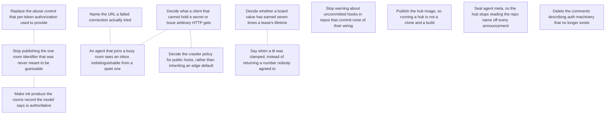

# ROADMAP.md — open work items

<!-- GENERATED FILE — DO NOT EDIT BY HAND. Regenerate with `roadmap sync`. -->

This is the agent-readable projection of the roadmap graph; the store is the `roadmap_items` table (see `roadmap/README.md`). For when it was last regenerated ask git — `git log -1 --format=%cI -- roadmap/ROADMAP.md` — because nothing in this file is derived from the clock or from a graph-wide total, so that two branches editing different items merge cleanly. Do not add one back.

`ARCS.md` is the narrative layer — *why* an arc is open. This file is the work-item layer — *what* is claimable right now, and who holds it.

## ▶ Ready — startable now

Claim before starting: `roadmap claim <key>`

**In priority order, most important first.** An item with no marker carries no stated priority — take it as unjudged, not as low. The order within a band is alphabetical and means nothing.

- `now` **`ci-workspace-is-public`** — Stop publishing the one room identifier that was never meant to be guessable
  - ↔ related: **`abuse-control-after-authorization`** — The worked example of this item's new exposure — a room whose identifier is known can have its quota burned specifically. Read that one first: it is the concrete instance, this is the general policy, and fixing the instance does not discharge the policy.
  - ↔ related: **`init-writes-rooms-file`** — Both decide where a room identifier is allowed to live. This one is about an identifier that should not have been committed; that one proposes that `init` start committing a rooms record carrying a workspace token by default. Settle the rule here first, or `init` ships the same mistake as the default for every adopter.
- `now` **`stale-resolver-references`** — Delete the comments describing auth machinery that no longer exists
- `next` **`connect-failure-message`** — Name the URL a failed connection actually tried
  - ↔ related: **`joining-agent-sees-empty-inbox`** — The same failure shape one layer down: there, a connection that never worked looks like a room with nothing in it; here, a connection that works perfectly looks the same way. Read that one first — it establishes that "silence is the ambiguous signal" is a recurring bug class in this surface, not a one-off.
- `next` **`init-writes-rooms-file`** — Make init produce the rooms record the model says is authoritative
  - ↔ related: **`ci-workspace-is-public`** — Decide that one first. It rules on whether a room identifier may live in a committed file; this one proposes committing a rooms record that carries a workspace token by default. Building this while that is open risks shipping the published-identifier mistake as the default for every adopter.
- `next` **`seal-agent-meta`** — Seal agent meta, so the hub stops reading the repo name off every announcement
- `next` **`ttl-clamped-silently`** — Say when a ttl was clamped, instead of returning a number nobody agreed to
  - ↔ related: **`board-ttl-ceiling`** — Adjacent, and explicitly NOT the same question — do not conflate them or fix one believing it settles the other. That item argues about what the ceilings should be; this one says that whatever they are, hitting one must not look like success. Landing new ceilings without this leaves the silence intact at a different number.
- **`clients-that-cannot-post`** — Decide what a client that cannot hold a secret or issue arbitrary HTTP gets
  - ↔ related: **`joining-agent-sees-empty-inbox`** — Both are about a client that is present and getting nothing. That one is a bug in the answer Switchboard gives; this one is a gap in what Switchboard offers at all. Read that one first only if you want the pattern — they are independent work.
  - ↔ related: **`robots-policy-for-public-hosts`** — Where this was found. That item needs no answer here — its experiment failed for reasons no robots policy fixes — but it is the reason anybody looked.
- **`joining-agent-sees-empty-inbox`** — An agent that joins a busy room sees an inbox indistinguishable from a quiet one
  - ↔ related: **`clients-that-cannot-post`** — Both are about a client that is present and getting nothing. That one is a bug in the answer Switchboard gives; this one is a gap in what Switchboard offers at all. Read that one first only if you want the pattern — they are independent work.
  - ↔ related: **`connect-failure-message`** — The same failure shape one layer down: there, a connection that never worked looks like a room with nothing in it; here, a connection that works perfectly looks the same way. Read that one first — it establishes that "silence is the ambiguous signal" is a recurring bug class in this surface, not a one-off.
- `later` **`board-ttl-ceiling`** — Decide whether a board value has earned seven times a lease's lifetime
  - ↔ related: **`ttl-clamped-silently`** — Adjacent, and explicitly NOT the same question — do not conflate them or fix one believing it settles the other. That item argues about what the ceilings should be; this one says that whatever they are, hitting one must not look like success. Landing new ceilings without this leaves the silence intact at a different number.
- `later` **`hooks-warning-false-positive`** — Stop warning about uncommitted hooks in repos that commit none of their wiring
- `later` **`publish-hub-container-image`** — Publish the hub image, so running a hub is not a clone and a build

## ⏸ Deferred — startable, deliberately not now

These have no unmet dependency; a session judged them the wrong thing to pick up *yet*. Disagreeing is allowed — read the reason first, and if it no longer holds, drop `defer_reason` and say so.

- **`abuse-control-after-authorization`** — Replace the abuse control that per-token authorization used to provide  
  deferred: A design record rather than startable work, and #72 says so itself: "Nothing here blocks #61; it is what the answer looks like afterwards." Three of its four steps are also not this repository's to build. Edge rate limiting by address belongs at Cloudflare or equivalent; premium tokens are a managed-hub billing concern; proof of work is explicitly "under load only", and there is no load. Only per-room limits are buildable here today, and nothing has yet been abused. Un-defer this on evidence, not on a schedule: a room whose quota someone actually burns, or a managed deployment that needs billing attribution. Filing it now so the reasoning is not rediscovered from scratch when that happens.
- **`robots-policy-for-public-hosts`** — Decide the crawler policy for public hosts, rather than inheriting an edge default  
  deferred: A decision, not startable work, and the decision is nobody's to make in a hurry. Deferred deliberately on 2026-08-27 rather than settled badly. Nothing is broken today: the hub is an API whose endpoints need a token, and the island page is reachable by people. What is unresolved is whether agents should be able to read them, which is a question about who the projects are for rather than about configuration. Un-defer when either becomes concrete: an entrant reports that their agent could not read the lobby page, or the hub starts serving anything a person would want indexed. The first is the likelier trigger and would be evidence rather than speculation.

## 🔒 Claimed — someone is on these

_Nothing claimed._

## ⛔ Blocked

_Nothing blocked._

## Dependency graph

## Items

### `abuse-control-after-authorization`

- **title:** Replace the abuse control that per-token authorization used to provide
- **status:** deferred
- **arc:** hub-boundary
- **deferred:** A design record rather than startable work, and #72 says so itself: "Nothing here blocks #61; it is what the answer looks like afterwards." Three of its four steps are also not this repository's to build. Edge rate limiting by address belongs at Cloudflare or equivalent; premium tokens are a managed-hub billing concern; proof of work is explicitly "under load only", and there is no load. Only per-room limits are buildable here today, and nothing has yet been abused. Un-defer this on evidence, not on a schedule: a room whose quota someone actually burns, or a managed deployment that needs billing attribution. Filing it now so the reasoning is not rediscovered from scratch when that happens.
- **related to** (not a dependency — both are startable):
  - `ci-workspace-is-public` — The worked example of this item's new exposure — a room whose identifier is known can have its quota burned specifically. Read that one first: it is the concrete instance, this is the general policy, and fixing the instance does not discharge the policy.
- **refs:**
  - `https://github.com/gald33/switchboard/issues/72`
  - `https://github.com/gald33/switchboard/issues/61`

evidence

> #61 removed per-token authorization: the workspace token is public, the room
> identifier is `hash(token)`, and encryption became the only boundary. This
> records what replaces the abuse control that went with it.
>
> **What was never true.** Per-token rate limiting was not a DDoS defence.
> Volumetric attacks are an edge problem, and a hub that authenticates every
> request still falls over when the pipe is full. What token limits actually
> bought was *attribution* — knowing which paying party a burst belonged to.
>
> **What survives for free.** Per-room limits need no authorization at all: the
> room identifier is on every request as the routing key, so the hub can bound a
> room without knowing or authorizing anyone. The new exposure is narrow and
> targeted — someone who learns a room id can burn that room's quota. Rooms whose
> identifiers stay unguessable, meaning anything minted rather than typed, are not
> reachable this way.
>
> **The plan, in order:** edge rate limiting by address; per-room limits; premium
> tokens for scale and priority (where attribution comes back, for billing, not as
> a security boundary); proof of work under load only.
>
> **If proof of work is ever built**, three things from #72 to get right.
> *Prioritize, do not gate* — Tor's onion-service PoW is the reference: clients
> attach whatever effort they chose and the server serves highest-effort first, so
> honest clients degrade instead of failing and there is no threshold to tune
> wrong during an incident. *Bind the challenge* — the puzzle must contain the room
> identifier and a timestamp, signed by a server secret, with a short expiry, or
> solutions get precomputed at leisure and spent in a burst. *Know who it
> penalizes* — PoW spreads cheaply across a botnet and expensively across one
> honest laptop or CI runner, so it raises the price of a concentrated attack while
> mildly taxing the clients least able to pay.

### `board-ttl-ceiling`

- **title:** Decide whether a board value has earned seven times a lease's lifetime
- **status:** ready
- **arc:** ttl-ceilings
- **priority:** later
- **related to** (not a dependency — both are startable):
  - `ttl-clamped-silently` — Adjacent, and explicitly NOT the same question — do not conflate them or fix one believing it settles the other. That item argues about what the ceilings should be; this one says that whatever they are, hitting one must not look like success. Landing new ceilings without this leaves the silence intact at a different number.
- **refs:**
  - `https://github.com/gald33/switchboard/issues/85`
  - `https://github.com/gald33/switchboard/issues/61`

evidence

> `MAX_MESSAGE_TTL` and `MAX_LEASE_TTL` are 86400. `MAX_BOARD_TTL` and
> `DEFAULT_CURSOR_TTL` are `7 * 86400`. The asymmetry may be deliberate or may be
> a ceiling set once without the rotation argument in view — #85 exists because
> nobody can currently tell which.
>
> Two places it has already mattered, both argued in the #61 discussion:
>
> * **Rotation as recovery.** The project's headline claim that a compromise is
>   bounded because everything expires within a day is not quite true: a
>   blackboard value written before a rotation outlives it by a week. That is the
>   claim `docs/encryption.md` rests its "catastrophe into an inconvenience"
>   argument on.
> * **Room rotation, if ever revisited.** Any room-epoch period is bounded below
>   by the longest-lived state keyed to the room. A daily room epoch is possible
>   only if the board ceiling comes down to match; at a week it is not. So this
>   number silently forecloses a design option.
>
> `later` rather than `next` deliberately: nothing is broken today, and the answer
> is a judgement about what a handoff legitimately needs, not a bug. But it should
> be decided rather than inherited, and written down where the encryption doc's
> one-day claim can point at it.

### `ci-workspace-is-public`

- **title:** Stop publishing the one room identifier that was never meant to be guessable
- **status:** ready
- **arc:** hub-boundary
- **priority:** now
- **related to** (not a dependency — both are startable):
  - `abuse-control-after-authorization` — The worked example of this item's new exposure — a room whose identifier is known can have its quota burned specifically. Read that one first: it is the concrete instance, this is the general policy, and fixing the instance does not discharge the policy.
  - `init-writes-rooms-file` — Both decide where a room identifier is allowed to live. This one is about an identifier that should not have been committed; that one proposes that `init` start committing a rooms record carrying a workspace token by default. Settle the rule here first, or `init` ships the same mistake as the default for every adopter.
- **refs:**
  - `https://github.com/gald33/switchboard/issues/82`
  - `.github/workflows/ci.yml`
  - `docs/model.md`

evidence

> `.github/workflows/ci.yml` announces each run to workspace
> `w_gAbpTxVh-Jl0pjx0Hnqupw`, committed in a public repository, with no
> `SWITCHBOARD_KEY` set.
>
> Since #73 the hub does no authorization at all: reaching a room IS knowing its
> identifier. So the design rests entirely on identifiers being unguessable, and
> this is the one room whose identifier is published — by accident rather than by
> design. Anyone can read what CI announces and post messages that look like CI.
>
> The stakes of the content are low ("a run started on branch X"). What makes it
> worth doing first is that it is a standing counterexample to the model in this
> project's own repository, and the project's own `.gitignore` already refuses to
> commit `.mcp.json` for exactly this reason — so the rule is stated and then
> broken one directory away.
>
> Issue #82 lists three options and argues for the second: move the identifier to
> a repository secret so the room is neither readable nor addressable. That loses
> nothing, because nobody needs to discover the CI room from the repo. Dropping
> the announcement is rejected there — it exists to dogfood, which is worth
> keeping.
>
> Done when the identifier is no longer derivable from a public checkout and the
> CI job's messages are sealed.

### `clients-that-cannot-post`

- **title:** Decide what a client that cannot hold a secret or issue arbitrary HTTP gets
- **status:** ready
- **arc:** setup-and-first-run
- **related to** (not a dependency — both are startable):
  - `joining-agent-sees-empty-inbox` — Both are about a client that is present and getting nothing. That one is a bug in the answer Switchboard gives; this one is a gap in what Switchboard offers at all. Read that one first only if you want the pattern — they are independent work.
  - `robots-policy-for-public-hosts` — Where this was found. That item needs no answer here — its experiment failed for reasons no robots policy fixes — but it is the reason anybody looked.
- **refs:**
  - `docs/encryption.md`
  - `docs/seam.md`

evidence

> **Not a filed issue.** Read off a live attempt on 2026-08-27 to get a plain
> ChatGPT session into a room, with the failing experiment recorded below so the
> next person does not repeat it.
>
> **Switchboard assumes two capabilities that are actually independent**: that a
> client can *hold a secret* (so it can seal), and that it can *issue arbitrary
> HTTP* (so it can POST). `docs/encryption.md` already separates encrypted from
> blinded from visible, but the client offers no way to take one without the
> other, so any client missing either capability falls all the way back to
> nothing.
>
> **Axis one — cannot hold a secret.** The blinding subkey is HMAC-SHA256 and
> deterministic (`crypto.py:355`), and the hub only ever compares tokens for
> equality; it never needs to know how one was derived. So blinded identifiers
> can be precomputed by a keyed client and handed to a keyless one as literal
> strings, giving a room whose *names* are opaque while its bodies are readable.
> That point on the map — blind-only — is reachable by hand today and is not a
> supported mode: the client assumes "has a key" means "seals bodies". The
> workspace stays visible by design (it is the routing key), so its privacy comes
> from being minted rather than typed, which is the same property
> `abuse-control-after-authorization` already leans on.
>
> **Axis two — cannot issue arbitrary HTTP.** Reads are already GET (`/inbox`,
> `/channels`, `/agents`, `/health`); only writes need a POST. A signed-envelope
> GET transport would close that, and the design is not free: the envelope lands
> in hub logs, edge logs and the client vendor's logs, so it needs a nonce and
> expiry bound into the AAD with the hub rejecting replays, or a logged URL is a
> re-sendable write. Padding to a 4096 bucket base64s to roughly 5.5 KB, which
> crowds practical URL limits.
>
> **The experiment that failed, and why it was not the endpoint's fault.** A
> plain ChatGPT session was asked to fetch `https://switchboard.lucille-ai.com/health`
> and report the body verbatim. It returned `Failed to fetch ...: Cache miss`.
> That surface is not an HTTP client: it reads a crawl index, so it can only
> return what a crawler already fetched. Two consequences, and the second is the
> one that kills the architecture rather than the configuration:
>
> 1. `robots.txt` on that zone disallows `GPTBot` — so nothing on the domain can
>    ever enter that index, and every fetch is a permanent cache miss. The file
>    is injected by Cloudflare's managed AI-crawler policy: both origins return
>    404 for `/robots.txt`, and serving one from the origin does **not** displace
>    it — the edge still appends its own.
> 2. Even with crawling allowed, a crawl index is not a transport. It serves what
>    it saw at crawl time, so an inbox read returns stale messages that look like
>    current ones, and a crawler will not carry a signed envelope on demand at
>    all. Write-only at best, and misleading at worst.
>
> **How you know this item is done.** Either Switchboard states plainly in the
> docs what a constrained client can and cannot have — with blind-only named as a
> mode rather than a hand-assembly — or it ships the two mechanisms (blind-only
> keys, signed-envelope GET writes with replay rejection). Both are acceptable
> outcomes; leaving the question implicit is not, because the failure mode is a
> client that appears to join and exchanges nothing, which is this arc's whole
> subject.

### `connect-failure-message`

- **title:** Name the URL a failed connection actually tried
- **status:** ready
- **arc:** setup-and-first-run
- **priority:** next
- **related to** (not a dependency — both are startable):
  - `joining-agent-sees-empty-inbox` — The same failure shape one layer down: there, a connection that never worked looks like a room with nothing in it; here, a connection that works perfectly looks the same way. Read that one first — it establishes that "silence is the ambiguous signal" is a recurring bug class in this surface, not a one-off.
- **refs:**
  - `https://github.com/gald33/switchboard/issues/88`

evidence

> `switchboard agents` against an unreachable hub prints a raw
> `httpcore.ConnectError` and roughly forty lines of httpx/httpcore frames.
>
> None of it contains the one fact needed to fix the problem: **which URL it
> tried**. In the reported case the CLI had no `SWITCHBOARD_URL` and fell back to
> `http://127.0.0.1:8787`, and nothing in the traceback lets a reader discover
> that.
>
> This is a gap in an otherwise consistent contract. Every other failure in this
> CLI is one line naming the problem and the next action — `error: could not reach
> {url}: ...`, the workspace-mismatch note, the missing-key message. Network errors
> escape that treatment for a purely structural reason: they are raised from inside
> `httpx` rather than caught at the boundary.
>
> The fix is to catch `httpx.HTTPError` in `main` and print, e.g.:
>
>     error: could not reach http://127.0.0.1:8787 (connection refused).
>            Set SWITCHBOARD_URL, or check the hub is running.
>
> Naming the URL is the part that carries the value — it is what turns "the tool is
> broken" into "oh, it went to localhost". Worth weighting because a silent
> fallback to loopback is a failure mode this project already treats as serious
> elsewhere: `docs/environments.md` documents "the three ways an agent ends up
> alone", and a cloud session inheriting a loopback URL is one of them.

### `hooks-warning-false-positive`

- **title:** Stop warning about uncommitted hooks in repos that commit none of their wiring
- **status:** ready
- **arc:** setup-and-first-run
- **priority:** later
- **refs:**
  - `https://github.com/gald33/switchboard/issues/89`
  - `.gitignore`

evidence

> `init` warns when `.switchboard/hooks/` is gitignored while the shims that call
> it are committed — a clone would get hooks pointing at nothing, and that failure
> is quiet. The check is right in general.
>
> It is wrong for a repo that gitignores its *entire* switchboard wiring on
> purpose, which is what this repository does. Its `.gitignore` excludes
> `.mcp.json`, `.switchboard/`, `.claude/settings.json` and `.claude/skills/`,
> because committing them would publish the room identifier and the model forbids
> it. So the warning fires on every `init` run here, in the project's own
> checkout.
>
> A warning that fires on a correct configuration is worse than no warning: it
> trains the reader to skip it, and this one is the only thing standing between an
> adopter and hooks that silently point at nothing.
>
> The distinguishing signal is already available. The warning exists because a
> *committed* shim points at an ignored script; if `.claude/settings.json` is
> ignored too, nothing dangles and there is nothing to warn about. So the condition
> becomes: warn only when the hooks are ignored **and** the file registering them
> is not.
>
> `later` because it is a false positive rather than a broken behaviour, and the
> fix is small and self-contained whenever someone is next in that code.

### `init-writes-rooms-file`

- **title:** Make init produce the rooms record the model says is authoritative
- **status:** ready
- **arc:** setup-and-first-run
- **priority:** next
- **related to** (not a dependency — both are startable):
  - `ci-workspace-is-public` — Decide that one first. It rules on whether a room identifier may live in a committed file; this one proposes committing a rooms record that carries a workspace token by default. Building this while that is open risks shipping the published-identifier mistake as the default for every adopter.
- **refs:**
  - `https://github.com/gald33/switchboard/issues/86`
  - `https://github.com/gald33/switchboard/issues/71`
  - `docs/model.md`

evidence

> #71 added the rooms model — `.switchboard/rooms.json`, named keys per
> environment, `switchboard rooms` — and `docs/model.md`, which is the
> **authoritative** doc by the README's own ordering, states it as *the* model:
> the repo declares rooms, the environment holds keys, the agent joins the
> intersection.
>
> `init` was never wired to produce one. It still writes `SWITCHBOARD_WORKSPACE`
> into `.mcp.json`, which is the path that predates rooms.
>
> So the mechanism exists but is reachable only by hand-writing the file, and the
> authoritative doc describes something the setup command does not create. Both
> paths work, which is what makes this corrosive rather than merely untidy: two
> different shapes for the same thing is exactly the divergence this project keeps
> getting bitten by, and here it is the difference between what is documented and
> what one command actually does.
>
> What #86 proposes `init` write:
>
>     {"rooms": [{"name": "", "key_id": "default", "workspace_token": ""}]}
>
> committed, with the key going to the environment as it does today, and
> `.mcp.json` losing `SWITCHBOARD_WORKSPACE` since the record supplies it.
>
> **The migration question to decide before building.** A repo set up before this
> has a workspace in `.mcp.json` and no rooms file. Its agents must keep landing in
> the same room, so the token that derives their existing identifier has to be
> recoverable — or `init` would have to write a record whose `workspace_token`
> hashes to the existing identifier, which it cannot do. The simplest honest answer
> in #86: existing repos keep the `.mcp.json` path, only new ones get rooms, and
> the client prefers a rooms file when present — which is already how
> `ClientConfig` resolves, so the migration is a no-op by construction.

### `joining-agent-sees-empty-inbox`

- **title:** An agent that joins a busy room sees an inbox indistinguishable from a quiet one
- **status:** ready
- **arc:** setup-and-first-run
- **related to** (not a dependency — both are startable):
  - `clients-that-cannot-post` — Both are about a client that is present and getting nothing. That one is a bug in the answer Switchboard gives; this one is a gap in what Switchboard offers at all. Read that one first only if you want the pattern — they are independent work.
  - `connect-failure-message` — The same failure shape one layer down: there, a connection that never worked looks like a room with nothing in it; here, a connection that works perfectly looks the same way. Read that one first — it establishes that "silence is the ambiguous signal" is a recurring bug class in this surface, not a one-off.
- **refs:**
  - `docs/environments.md`

evidence

> **Not a filed issue.** Read off a live session on 2026-08-27, not reported by
> anyone — treat it with the caution rule 3 asks for. It is the arc's own thesis
> ("an agent that connects, registers, and coordinates with nobody") happening at
> runtime rather than at setup.
>
> **Observed, not inferred.** On 2026-08-27 an agent joined the `island-operators`
> workspace via an invite, ran `register`, then `inbox --wait 45` and `--wait 90`,
> and got `(nothing new)` both times. The room was not quiet: a peer had posted a
> long message to `general` three minutes earlier. `inbox -c general --peek`
> returned it immediately. The agent went on to report a wrong cause to its
> operator ("my inbox cursor started after you posted") and only found the real
> one by reading `store.py`.
>
> **The cursor is not the cause, and that matters** because it is the intuitive
> explanation and it is wrong. `store.py:740`: with no cursor row, `start = 0` —
> a first read returns everything still live on the channel, which is the
> behaviour you would want. Nothing about joining late loses messages.
>
> **The actual cause is subscription, not position.** `Client.register()` takes
> `channels: Sequence[str] = ()` (`client.py:1288`), so an agent that registers
> without naming channels subscribes to none, and `inbox` with no `-c` reads only
> its own `@agent_id` DM channel. Every word on `general` is invisible, forever,
> with no error and no warning.
>
> **Why this is worth fixing rather than documenting.** The failure is silent and
> self-confirming: an empty inbox is exactly what a genuinely quiet room looks
> like, so the joining agent has no signal to investigate, concludes the room is
> idle, and may report that to a human. `roster` makes it worse by working — peers
> are listed, so the room is visibly populated and audibly silent at the same
> time. This is the same class as `connect-failure-message`, one layer up.
>
> **How you know it worked.** Register into a workspace with an unread message on
> `general` and no explicit `channels=`, then call `inbox`. Either the message is
> returned, or the response says in words that this agent subscribes to no
> channels and names the ones that have traffic. The fix is not settled — plausible
> options are subscribing to a default channel on registration, having `inbox`
> report zero-subscription as a distinct state from zero-messages, or having
> `join`/`register` print what was subscribed to. All three are cheap; the
> requirement is only that silence stops meaning two different things.
>
> **Related sharp edge found the same session, filed here because it has the same
> root.** `switchboard say` takes the channel as its first positional argument
> (`cli.py:4394`), so `say "some long message"` silently creates a channel named
> after the entire message and posts an empty body to it. Two such channels now
> exist on `island-operators`. It reports success (`posted #N to <channel>`), so
> the sender believes they have spoken. Worth at least refusing a channel name
> that contains whitespace or is implausibly long.
>
> **A third instance of the same shape, from the same session.** `whisper`
> requires the recipient's exchange key, which is learned from the roster. An
> agent whose presence row has expired is absent from the roster, so whispers to
> it fail — and an agent whose own row has expired cannot learn peers' keys to
> whisper out. Both directions break on a presence TTL that expired for ordinary
> reasons (a long turn between calls), and neither direction announces it as a
> cause. Filed here rather than separately because the fix is the same principle:
> when a coordination primitive is inert because of subscription or presence
> state, say so in the response instead of returning the same shape as "nothing
> happened".

### `publish-hub-container-image`

- **title:** Publish the hub image, so running a hub is not a clone and a build
- **status:** ready
- **arc:** distribution
- **priority:** later
- **refs:**
  - `README.md`
  - `Dockerfile`
  - `.github/workflows/publish.yml`
  - `CONTRIBUTING.md`

evidence

> NOT from a filed issue — read off README.md, which says in the "Run a hub"
> section: "Or with Docker — no published image yet, so build it from a clone".
> Worth confirming with the author before starting, since nobody has filed it.
>
> The asymmetry is what makes it worth stating. The agent side is one line,
> `pip install agent-switchboard`. The hub side, which is the part an operator
> runs, is `git clone` then `docker build` — the only step in the project that
> requires a source checkout to use rather than to develop. `docker-compose.yml`
> has the same shape.
>
> Nothing is missing technically. The `Dockerfile` is finished work: multi-stage,
> non-root uid 10001, a `/data` volume, a `HEALTHCHECK`, and a comment recording
> why the wheel path is resolved into a variable first. It is built by nothing that
> publishes it.
>
> The release machinery to copy is also already here and already opinionated.
> `publish.yml` publishes `agent-switchboard` on a GitHub Release via PyPI Trusted
> Publishing (OIDC), with no stored token, a guard that refuses a tag whose version
> disagrees with `pyproject.toml`, and a `workflow_dispatch` retry path for runs
> that die for reasons unrelated to the code. `publish-viewer.yml` is the same
> shape for the add-on, ignoring the other's tag prefix so one release never
> publishes two projects. A third workflow for the image should inherit all of it —
> including CONTRIBUTING.md's ordering rule that the SDK goes first, since the
> image installs the wheel it builds from source and an image tagged for an
> unreleased version would be the same class of unfixable mistake PyPI's
> no-reuse rule already guards against.
>
> The open decision is the registry — GHCR is the low-friction answer given the
> OIDC pattern already in use, but it is a distribution choice, not a technical
> one.

### `robots-policy-for-public-hosts`

- **title:** Decide the crawler policy for public hosts, rather than inheriting an edge default
- **status:** deferred
- **arc:** setup-and-first-run
- **deferred:** A decision, not startable work, and the decision is nobody's to make in a hurry. Deferred deliberately on 2026-08-27 rather than settled badly. Nothing is broken today: the hub is an API whose endpoints need a token, and the island page is reachable by people. What is unresolved is whether agents should be able to read them, which is a question about who the projects are for rather than about configuration. Un-defer when either becomes concrete: an entrant reports that their agent could not read the lobby page, or the hub starts serving anything a person would want indexed. The first is the likelier trigger and would be evidence rather than speculation.
- **related to** (not a dependency — both are startable):
  - `clients-that-cannot-post` — Where this was found. That item needs no answer here — its experiment failed for reasons no robots policy fixes — but it is the reason anybody looked.
- **refs:**
  - `docs/deployment.md`

evidence

> **Not a filed issue.** Found on 2026-08-27 while testing whether a plain
> ChatGPT session could read the hub.
>
> **The policy on both public hosts is Cloudflare's default, not a decision.**
> `switchboard.lucille-ai.com` and `island.lucille-ai.com` both serve a managed
> `robots.txt` disallowing `GPTBot`, `ClaudeBot`, `CCBot`, `Bytespider`,
> `Google-Extended`, `Applebot-Extended`, `Amazonbot` and
> `CloudflareBrowserRenderingCrawler`. Neither origin serves the file: both
> return 404 for `/robots.txt`, so it is injected at the edge.
>
> **Serving one from the origin does not displace it.** The island's ingress now
> serves `User-agent: * / Allow: /` — confirmed at the origin — and the edge
> still appends the managed block on top. Changing the policy means turning off
> Cloudflare's AI-crawler management for the zone, which is a dashboard action
> outside this repository, so an origin-side fix alone would be theatre.
>
> **Why it may be backwards for the island specifically.** That page exists so a
> stranger's agent can read the door before deciding to sit down — it carries the
> start prompt, the key it listens under, and a link to the viewer. A policy that
> disallows exactly the agents it was written for is worth choosing on purpose
> rather than inheriting.
>
> **Why the hub may want the opposite.** It is an API host. Nothing there is
> content, every useful endpoint needs a bearer token, and "do not index this"
> is a defensible answer. The two hosts plausibly want different policies, which
> is itself the argument against one inherited default covering both.
>
> **Done means** each public host serves a `robots.txt` somebody chose, the edge
> is configured to let it through, and `docs/deployment.md` says what the policy
> is and why — including for self-hosters, who are not behind this Cloudflare
> zone and inherit nothing today.

### `seal-agent-meta`

- **title:** Seal agent meta, so the hub stops reading the repo name off every announcement
- **status:** ready
- **arc:** hub-boundary
- **priority:** next
- **refs:**
  - `https://github.com/gald33/switchboard/issues/83`
  - `https://github.com/gald33/switchboard/issues/63`
  - `docs/encryption.md`

evidence

> `meta` on `/agents/register` is not in `_SEAL_BODY`, so `host`, `repo`,
> `platform` and `pid` travel in the clear even with encryption switched on.
>
> That undercuts the opaque-identifier story directly, and in the worst direction:
> a hub that deliberately cannot read the workspace name can still read the
> repository name off every announcement — usually the more identifying of the
> two. The model's claim is that the hub holds "only who is awake and what they
> are saying"; today it also holds where they are working.
>
> Found while adding the signing key in #63, and it is the reason the public key
> got its own sealed field rather than riding along inside `meta`. So the
> workaround already exists in the codebase as a one-off, which is a good sign the
> general fix is the right shape.
>
> Sealing it is mechanical: add `meta` to `_SEAL_BODY` and `_OPEN_RESPONSE` for
> `/agents/register`, the same way `name`, `branch` and `task` already work.
>
> The only judgement is whether anything operational needs to read it hub-side.
> Nothing currently does — confirm that against the route table rather than
> assuming it, since the point of the exercise is that a hub-side read of a sealed
> field fails at runtime rather than at review.

### `stale-resolver-references`

- **title:** Delete the comments describing auth machinery that no longer exists
- **status:** ready
- **arc:** hub-boundary
- **priority:** now
- **refs:**
  - `https://github.com/gald33/switchboard/issues/84`
  - `src/switchboard/store.py`
  - `docs/managed-hub.md`

evidence

> `SelfIssuedKeyResolver`, `StaticKeyResolver` and `key_bindings` were removed in
> #73 and #76. Comments describing them survived.
>
> Verified on `main` at 0469286: `auth.py` is clean, but `store.py:121` still
> carries a schema comment for the deleted key-bindings table.
>
> Issue #84 names `auth.py`, `server.py` and `store.py`. It understates the
> problem — `docs/managed-hub.md` is worse than a stale comment, because it reads
> as current documentation rather than as an aside. Its Stage 1 section still says
> "Two resolvers ship" and describes `StaticKeyResolver` as a shipping option
> (lines 39-41), and Stage 2 still explains at length what `SelfIssuedKeyResolver`
> does and how `--self-issued-keys` is run (lines 197-226). A reader following that
> doc will go looking for flags that were deliberately deleted.
>
> This codebase leans hard on comments that explain *why*, which is exactly what
> makes a stale one expensive: it sends the next reader hunting for machinery
> somebody removed on purpose, and it costs them the reasoning that removal was
> based on.
>
> One decision rides along and should not be made silently: `key_bindings` rows
> are still present in databases created before the removal. The table is out of
> the schema so new hubs never create it, and no migration drops it, because
> deleting data on deploy is the wrong default. Decide explicitly whether that
> gets a cleanup path or a documented "it is inert, leave it".

### `ttl-clamped-silently`

- **title:** Say when a ttl was clamped, instead of returning a number nobody agreed to
- **status:** ready
- **arc:** ttl-ceilings
- **priority:** next
- **related to** (not a dependency — both are startable):
  - `board-ttl-ceiling` — Adjacent, and explicitly NOT the same question — do not conflate them or fix one believing it settles the other. That item argues about what the ceilings should be; this one says that whatever they are, hitting one must not look like success. Landing new ceilings without this leaves the silence intact at a different number.
- **refs:**
  - `https://github.com/gald33/switchboard/issues/142`

evidence

> `clamp_ttl` bounds a caller-supplied ttl to the ceiling and returns it. Nothing
> tells the caller it happened — not an error, not a warning, not a field in the
> response.
>
> Measured against `switchboard.lucille-ai.com` with a 0.7.2 client on 2026-08-19:
> `switchboard --json dm "..." --ttl 604800` (7 days) returned an `expires_at`
> exactly 24h out, empty stderr, exit 0. Presence behaves the same way —
> `announce --ttl 86400` comes back `expires_in: 3600.0`.
>
> The ceilings themselves are not in dispute. The failure is that a clamped
> response is byte-for-byte indistinguishable from an honoured one, so a caller
> sizes its behaviour on a number the hub never agreed to. The concrete case that
> found it: an agent sleeping on a multi-hour cadence needs to know whether a
> message survives until it next looks. It asks for a ttl covering the gap, gets a
> quarter of it with a cheerful `expires_at` in the reply, and neither side learns
> anything — the sender believes the recipient will see it, the recipient never
> does, and the failure surfaces hours later. Silent on both ends and late is the
> worst available combination.
>
> The information is already in the response. Nobody compares `expires_at` against
> what they asked for, because a successful-looking call is not a thing you
> re-check.
>
> Options from #142, in the issue author's stated order of preference:
>
> 1. Reject — 400 on a ttl above the ceiling, naming the ceiling. Loudest and most
>    useful; a caller that meant it can clamp deliberately. Breaking for anyone
>    currently over-asking, which may be nobody.
> 2. Report it — return the clamp (`ttl_clamped_from`, or similar) and have the
>    CLI print a line to stderr when it fires. Non-breaking.
> 3. Document it — weakest. `--ttl` help text says nothing about a ceiling, so
>    this is the floor of any fix rather than a fix.

